# Unit 0. Introduction <!-- omit from toc --> 

- [VM's in VirtualBox](#vms-in-virtualbox)
- [VM's in Ms Azure](#vms-in-ms-azure)
  - [Windows Server installation in Ms Azure](#windows-server-installation-in-ms-azure)
    - [Connection using KRDC](#connection-using-krdc)
    - [Connection using Microsoft Remote Desktop](#connection-using-microsoft-remote-desktop)
  - [Windows 10 client in Ms Azure](#windows-10-client-in-ms-azure)
- [VM's in AWS (Amazon Web Services)](#vms-in-aws-amazon-web-services)
  - [Connection using KRDC](#connection-using-krdc-1)
  - [Connection using Microsoft Remote Desktop](#connection-using-microsoft-remote-desktop-1)

In this unit we will focus on creating the environment we will use in future units to install the Oracle database server and clients, and perform all the tasks we will learn. We could use a real server, should we have one. But that is not likely the case, so it is better and less expensive to work with virtual machines.

Among all the possible options you can choose between the following:

- VMs in VirtualBox
- VM in Microsoft Azure Cloud
- VM in Amazon Web Services

If you decide to use VirtualBox, I will provide you the .ova files to create the virtual machines in your computer. If you decide to use Ms Azure or AWS, I will show you how to create the VM in the cloud. Each solution has advantages and disadvantages. The following table shows you some of them to help you take the decision:

| Item                              | VirtualBox | Cloud                                              |
| --------------------------------- | ---------- | -------------------------------------------------- |
| PC Hard disk usage                | High       | Very low                                           |
| PC CPU requirement                | High       | Very low                                           |
| Network usage                     | Low        | High                                               |
| Use from different PC's           | Difficult  | Very easy                                          |
| Number of simultaneous running VM | Low        | Unlimited                                          |
| Velocity to create a VM           | Low        | Very High                                          |
| Usage charges                     | No         | Yes when Azure for students credit (100$) finished |
| Platform complexity | Low | High |
| Know how to use it to get a job | Medium | Very high |

As a conclusion I would say that if you don't have a very powerful PC, the cloud would be your choice. In other cases, just decide considering which characteristics are more important to you: disk usage, mobility, learning new systems...

In any case you are going to need a Windows Server to install the Oracle 11g DBMS. In a real environment the DMBS is installed in a machine inside a data center or in the cloud. The DBMS administrators rarely connect directly to this server, but they access the DBMS remotely. Thus, we will learn to connect to the DMBS from a different PC. 

Depending on your PC operating system and the availability of the client programs for it, you can decide to install the client programs in your own PC or create a client VM to install these programs. Therefore we will need:

- Windows Server 2008 or higher
- Windows 7 or higher as client (optiona)

## VM's in VirtualBox

At this point you might know quite well how to work with VirtualBox. If you decide to use this system, you have to create these virtual machines:

- Windows Server 2008
- Windows 7 (optional as client)

You can find the .ova files [here](https://gvaedu-my.sharepoint.com/:f:/g/personal/j_munozjimeno_edu_gva_es/Etr345tDiSlDsyGdSrelkZIBSFHwZSd1TLmdrYH9Ov8dEw?e=Dev4Br).

Create both machines, configure them with "bridged network" and create a shared folder with your host machine to easily change files between them.

## VM's in Ms Azure

If you decide to use Ms Azure, we can use newer versions of the operating systems, as they are available in the platform. In this case we will use:

- Windows Server 2012
- Windows 10 (optional as client)

Here you have all the information you need to install the Windows Server.

### Windows Server installation in Ms Azure

In this note we will see how to create a Windows Server 2012. We will use that machine to install our Oracle Database afterwards.

First, we have to access the [Azure Portal](https://portal.azure.com/) using our Azure for Students Account.

In the next images we will display with a red square the options that have to be changed or revised. You can forget about the rest of available options.

Once logged in, we will create a new resource. 

As we are going to deply a Windows Server, let's find the available options typing down "Windows server" in the search bar.

Select "Windows Server"

Let's use Windows Server 2012 R2 Datacenter, that is the minimum Server available.

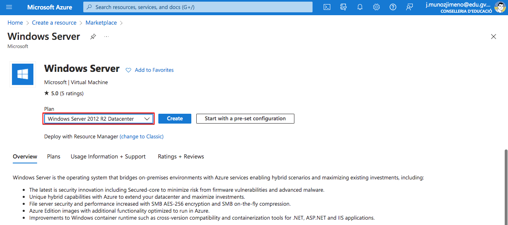

In the next screen, make sure that the "Azure for Students" suscription is selected. Create a new "Resource group" to allocate all necessary resources (virtual machine, virtual network, disks...)

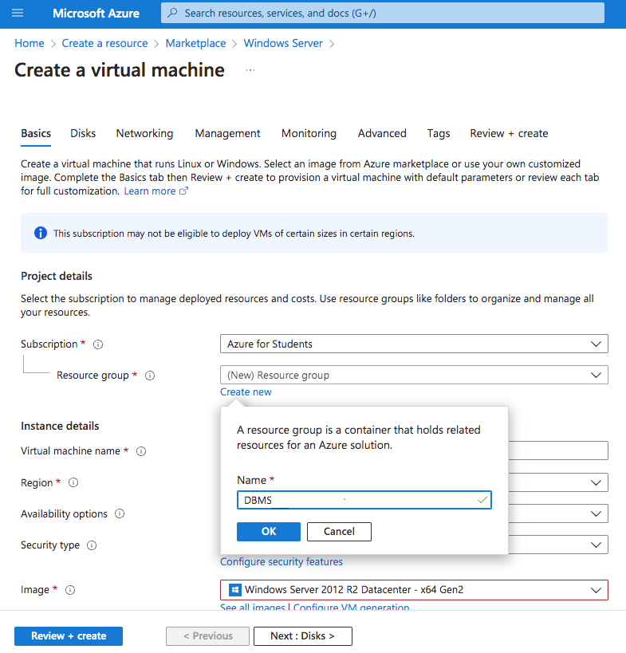

Configure the "Project details" as shown. That is enough for our needs while keeping the costs down. The size can put up the costs quite a bit. Make sure that you select the proposed size. Don't keep the default.

Fill in the administrator account

Now we create the disk where the OS will be installed.

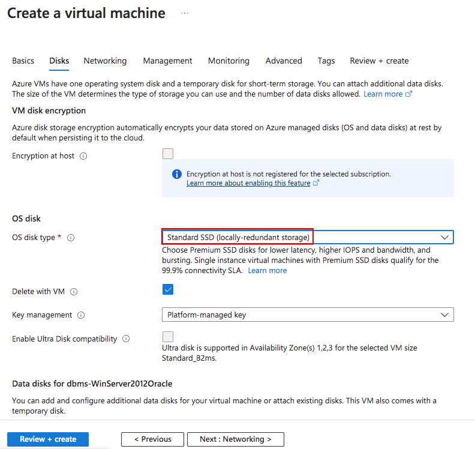

Finally, we create the virtual network. Let's keep the default options for now. We can "Revise and create" the resources now.

If all is correct the validation will be completed and we can proceed and create the resources. Make sure the costs ara similar to the ones shown in the image. If they are bigger, go back and revise the selected options.

The resources will be implemented and the machine will be created.

It could be a good idea to configure the automatic shutdown so the machine is shut down every night in case we forget to shut it manually to avoid innecesary costs.

Once the VM is created we will see all the information about it. It is interesting to check the private and public IP addresses, as we will need them to connect to the VM.

> ATENTION!
> 
> The public IP address could change. Make note of the new IP each time you try to connect to the VM.

We can now connect to our Windows Server using RDP protocol. It allows us to make a graphical connection to the machine. Make click on "Connect" and then select RDP.

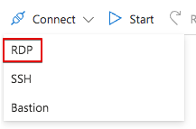

Here we have all the necessary information to connect to the VM, the IP address and port.

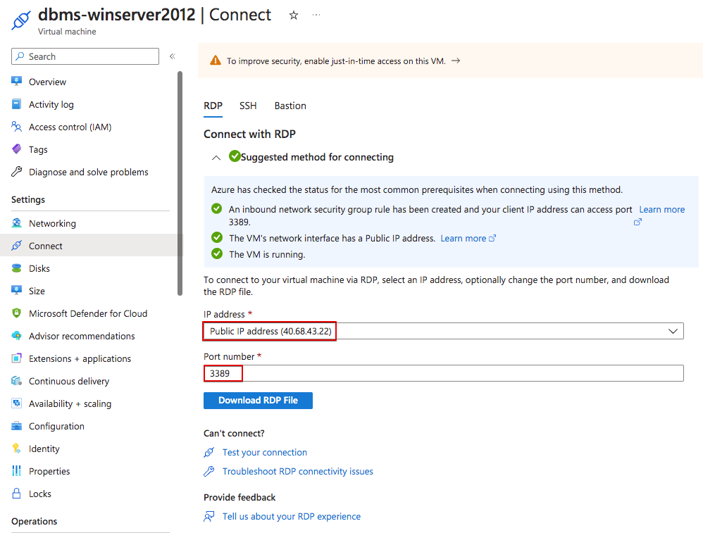

We can now use a Remote Desktop software to make the connection. In lliurex we have KRDC and Remmina. We could also use Windows Remote Desktop in Windows or Mac.

#### Connection using KRDC

In the following images we can see how to use KRDC to make the connection.

Just select protocol RDP and the public IP address.

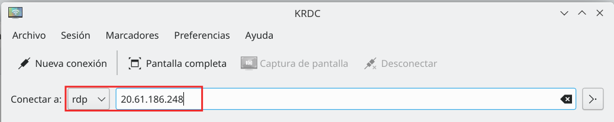

We can configure some things, such as the screen resolution or keyboard. You can also make a folder in your hard disk available to your VM, the same way you use shared folders in VirtualBox.

It will then ask for the user and password.

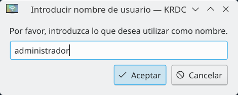

And the connection will be stablished.

#### Connection using Microsoft Remote Desktop

You can use Microsoft Remote Desktop in Windows and Mac.

As in KRDC we can have share folders between our computer and the Azure Virtual Machine, the same way we share folders in a virtualization software (such as VirtualBox).

Download the software for Windows from [Microsoft Store](https://apps.microsoft.com/) or for Mac in the [App Store](https://www.apple.com/es/app-store/).

Yo can quicky connect to the VM downloading the RDP file from azure and them make doble click on it.

But I advise to do it this other way to create a shared folder first. Open Microsoft Remote Desktop and go to menu "Connections -> Add PC".

Then follow the steps. Fill in PC name with the public IP address of the VM. In User account create a new one for the "administrador" user previously created.

In "Folders" tab, create a shared folder with your computer. First create the local folder. Then, use the "+" button to add it.

Next time you open the connection, you will find a network drive in your VM which is the local folder in your PC. It is a very convenient way to share files between both systems.

Once all configuration is finished you will find it in the main page each time you open the application.

> REMEMBER
>
> The VM public IP will change. You will have to edit the created connection each time you want to connect to the VM, but you will just have to change the IP address, keeping the rest of the configuration.

### Windows 10 client in Ms Azure

To install the Windows 10 client, just follow the same steps that for the Server but select the following options:

- Resource group: DBMS (the one previously created)
- VM name: dbms-win10client
- Image: Windows 10 Pro, version 21H2 - x64 Gen2
- Size: Standard_DS1_v2 - 1 vcpu, 3,5
- Virtual network/subnet: 
dbms-winserver2012-oracle-vnet/default (the one previously created)

## VM's in AWS (Amazon Web Services)

In this case we will use a Learning Lab in AWS Academy. You should have an AWS Academy student account.

In AWS we can only create servers but not desktop machines. Therefore, we cannot create a Ms Windows 10 or 11 desktop VM to act as a client. We can either create another Windows Server to act as client or use the client tools in our own computer.

In this note we will see how to create a Windows Server. We will use that machine to install our Oracle Database afterwards.

First, we have to access the [AWS Academy portal](https://www.awsacademy.com/vforcesite/LMS_Login) using our AWS Academy Account.

In the next images we will display with a red square the options that have to be changed or revised. You can forget about the rest of available options.

Once logged in, find the learner lab your teacher has prepared for this course. 

Select "Modules" to access the lab.

Open the "Learner Lab".

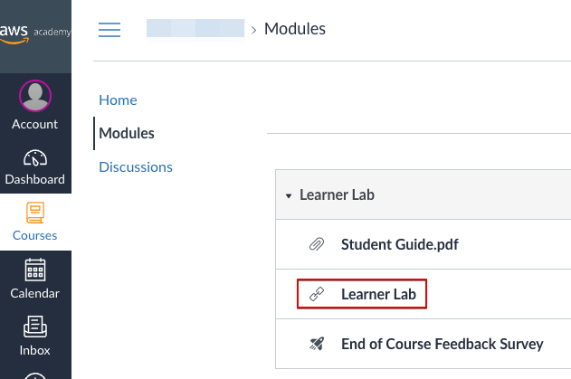

Start the lab:

Once started you will see a green dot next to AWS. Click there to open the AWS console and start working.

Now you have access to the AWS console. Depending on your previous use of this console you might see different things on the screen.

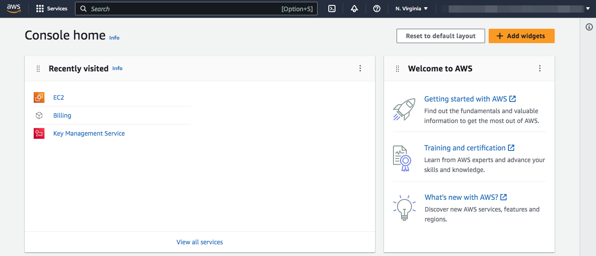

In AWS the Virtual Servers are called EC2. Let's start by creating one EC2 then. You can do it different ways. Let's see one of them. Scroll down to "Build a solution" and click on "Launch a virtual machine"

We have to give the parametres to create the machine. Follow the screens with the provided data.

A Windows Server 2016 will be enogh for us:

Oracle requirements are important. We can choose a t2.large instance type with 2 virtual CPU and 8GiB Memory.

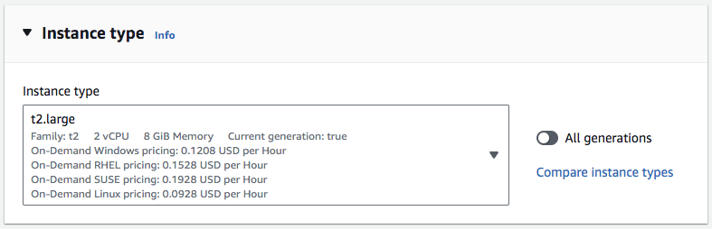

The Key pair (login) section is very important as here we will create the key pair that will allow us to remotely access the server. Let's create a new key pair.

Make sure you store the key pair in your computer or you won't be able to access the server afterwards.

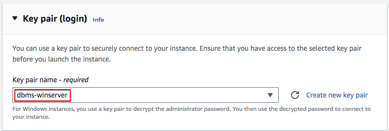

We have to define the network settings of our VM. We need to access it via RDP and later, access the Oracle console using https. Let's allow RDP, HTTP and HTTPS from the internet.

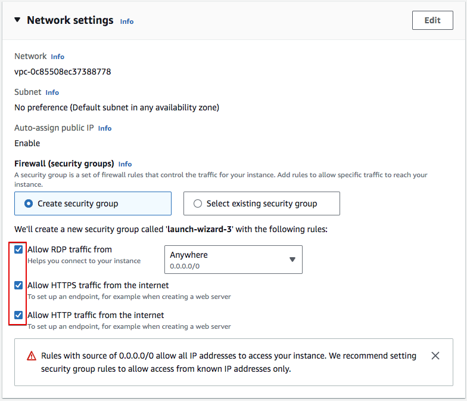

Finally, we have to configure the storage. Let's provide a 80GiB volume so Oracle can run smoothly.

Check all the selected options and Launch the instance.

If all goes well the instance is created and we can now see it in the EC2 console.

In the EC console we see that the VM is running and all realated data, such as the public IP address we will later need to access the OMS.

We can now access the server using RDP. First click on "Connect" to allow the connection. Select RDP client. And, first of all, let's get the Administrator password.

Remember the "key pair" I told you to store in your computer previously. That's the one you have to use now. Use "Upload private key file" and upload your stored "key pair".

Once readed, you can "Decrypt passwod"

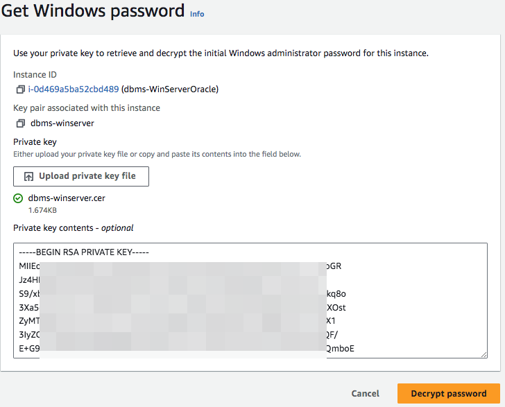

It will be a difficult to remember password. Just copy it and you can then change it from inside Windows server.

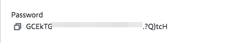

It is a good practice to create a text document and copy there all the information in the "Connect to instance" screen: Instance ID, Public DNS, User name and Password. 

We can now use a Remote Desktop software to make the connection. In lliurex we have KRDC and Remmina. We could also use Windows Remote Desktop in Windows or Mac.

Before yo connect to the server, just remember you have to finish the lab each time you finish working. Just go to the AWS Academy console and press "End Lab". If you don't do it the lab will be automatically closed after 4h.

### Connection using KRDC

In the following images we can see how to use KRDC to make the connection.

Just select protocol RDP and the public DNS (instead of the IP shown in the image).

We can configure some things, such as the screen resolution or keyboard. You can also make a folder in your hard disk available to your VM, the same way you use shared folders in VirtualBox.

It will then ask for the user and password.

And the connection will be stablished.

### Connection using Microsoft Remote Desktop

You can use Microsoft Remote Desktop in Windows and Mac.

As in KRDC we can have share folders between our computer and the Virtual Machine, the same way we share folders in a virtualization software (such as VirtualBox).

Download the software for Windows from [Microsoft Store](https://apps.microsoft.com/) or for Mac in the [App Store](https://www.apple.com/es/app-store/).

We can now "Download remote desktop file" to quickly access de Server.
Just download the RDP file from AWS and them make double click on it.

But I advise to do it this other way to create a shared folder first. Open Microsoft Remote Desktop and go to menu "Connections -> Add PC".

Then follow the steps. Fill in PC name with the public DNS of the VM. In User account create a new one for the "Administrator" user previously created with the Password retrieved.

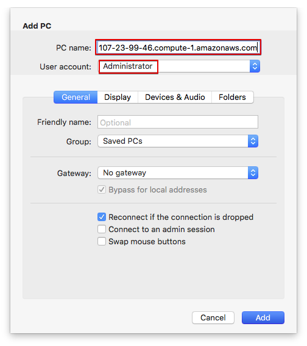

In "Folders" tab, create a shared folder with your computer. First create the local folder. Then, use the "+" button to add it.

Next time you open the connection, you will find a network drive in your VM which is the local folder in your PC. It is a very convenient way to share files between both systems.

Once all configuration is finished you will find it in the main page each time you open the application.

> REMEMBER
>
> The VM public might will change. You will have to edit the created connection each time you want to connect to the VM, but you will just have to change the IP address, keeping the rest of the configuration.

