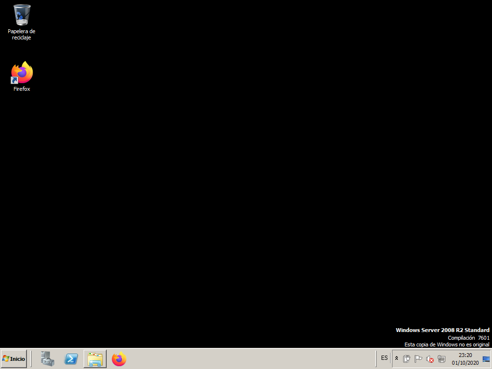
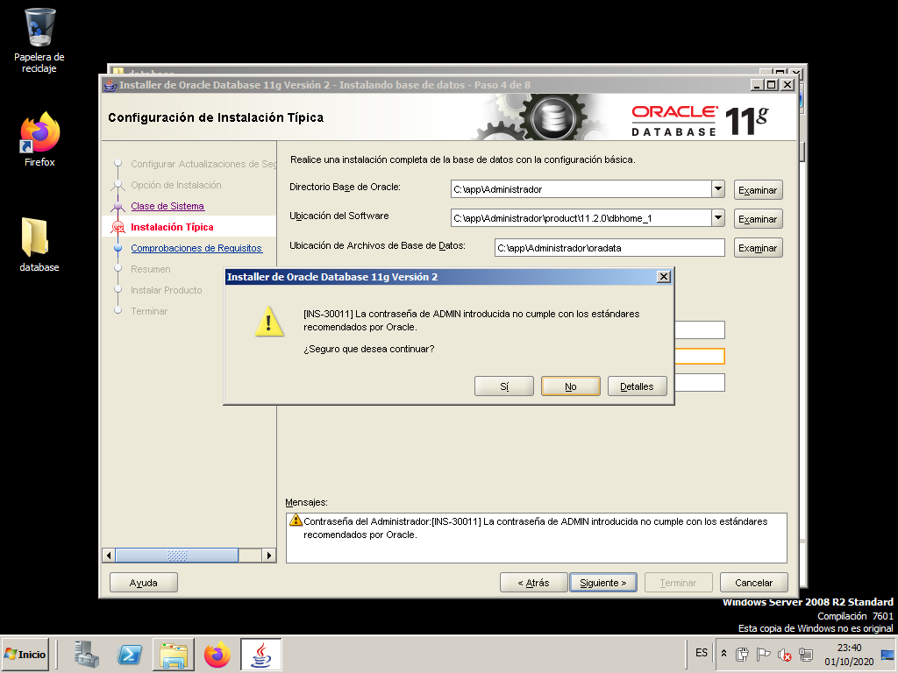
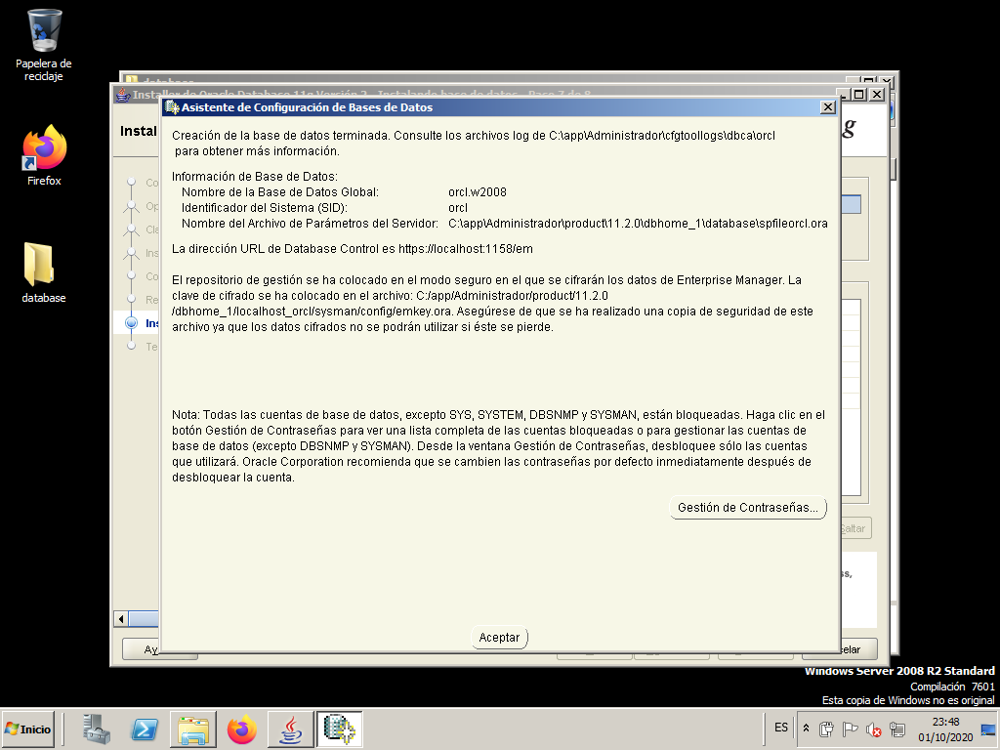
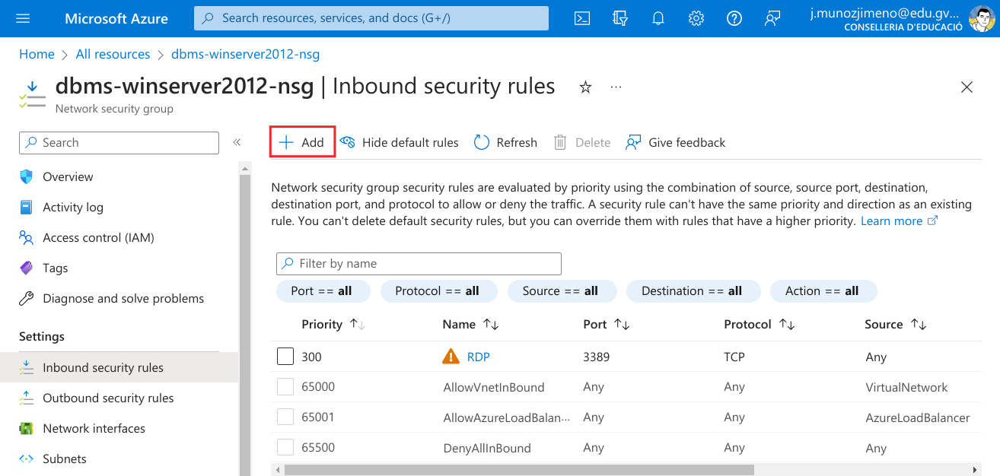
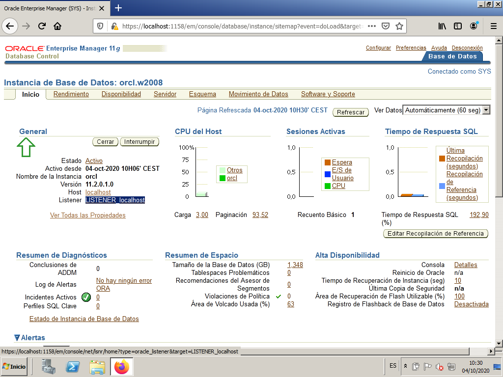
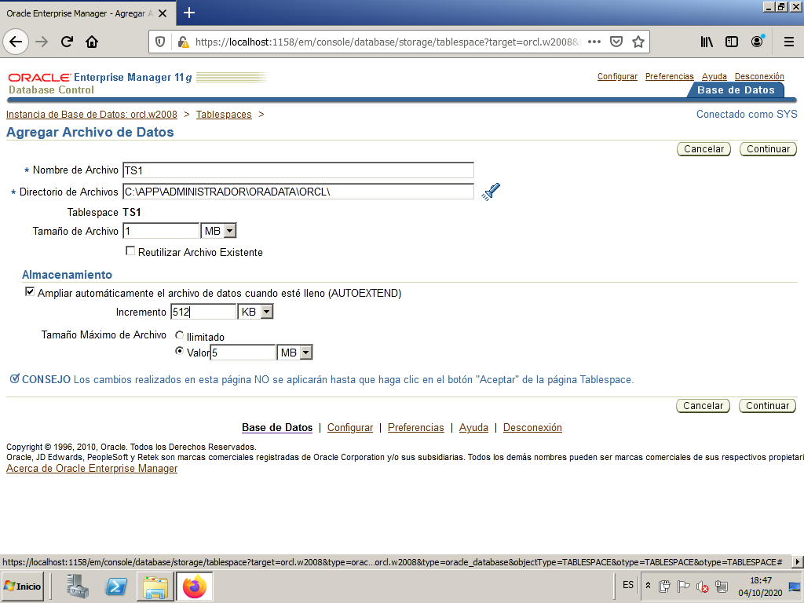
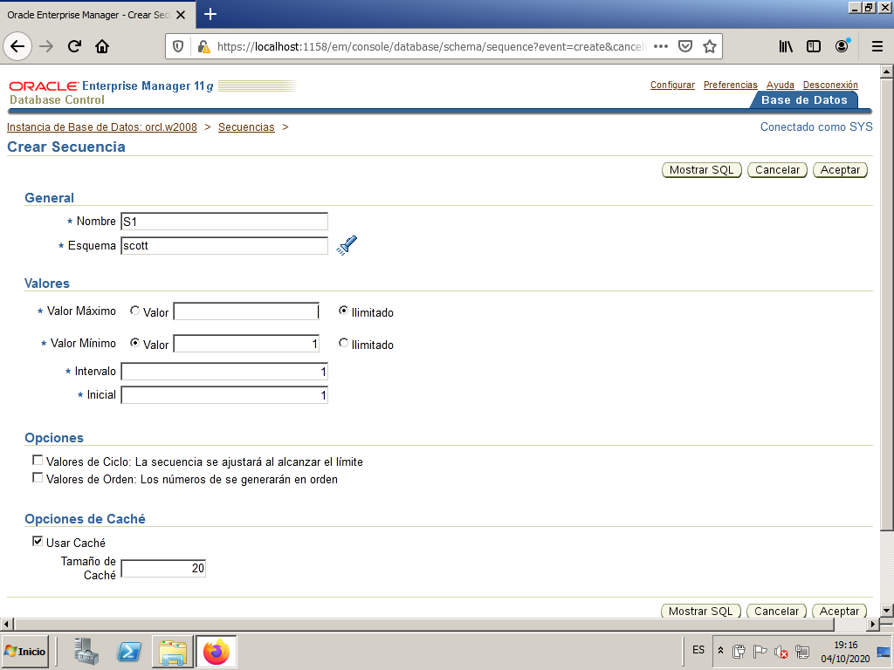

# Unit 2. Oracle DBMS basics. <!-- omit from toc --> 

## Introduction.

### Objectives

Last year in Database Management module, Databases have been designed, translated into the Relational Model, and implemented either in Access or in Oracle. Access to the Database has also been made through the SQL language, both to retrieve information or modify it, and to create the Database itself (the tables).

Practical experience has also been gained in what the client-server architecture in Oracle consists of, but only from the client's perspective.

The objective of this unit will be to install and configure a large Database, such as Oracle. Specifically, these tasks of managing the Database include, among others:

- Know its basic structure.
- Install the Oracle Server.
- Start and stop the Database.
- Organize the physical space where the data is stored.
- Manage the objects directly.

### Functions of the Database Administrator (DBA)

The Database Administrator (DBA: DataBase Administrator) is the person responsible for the proper functioning of the Database, its installation, and correct operation. Among their functions we can find:

- Installation of the DBMS, and possible updates.
- System startup and shutdown, although this can be done automatically.
- Resource allocation: memory, hard disk, ...
- Authorize access to the DB by creating users who can access the database and specifying to which parts they do it. If there are many users, as many will have the same or similar permissions, they will have to be managed by groups (in Oracle, a ROLE must be created).
- Administration of the objects of the DB. Although users can create their own objects (tables, views, synonyms), there will be times when the administrator will have to manipulate them directly.
- DB Backup. These could be divided into partial and total backups. In case of information loss, the administrator will have to recover it.
- Optimize the system for better performance, both regarding the adjustment of the current system and improvements in hardware and software (tools).

We will see each of these functions throughout the unit, first with a short general description and then specific to Oracle. Even if any of these functions can be done in more than one way, we will try to see them all.

### Oracle DBMS estructure

Before exploring the functions of the Administrator in Oracle, it is convenient to know a little about its structure, how it is organized, to be aware of what we are doing.

In "smaller" DBMSs, such as ACCESS, all the tables of a specific theme (with possible queries, forms, reports, etc.) are stored in a single file. Therefore, a Database, understanding it as a set of related data belonging to a specific "universe," is saved in a file with an .mdb extension. In DBASE, each table was stored in a file, and the Database was all that was saved in a directory.

In ORACLE, many users can connect (it is therefore a "large" DBMS), and a Database (more specifically an instance, as we will see later) is the set of all the tables created by all users, including the administrators, who will have many tables at their disposal to manage everything.

In this sense, the closest to the conception of a Database as mentioned above (a set of related data belonging to a specific "universe") in ORACLE are users. It would be absurd to create an entire Database instance, with the work of administering it, for a Database of 10 tables. However, it is very reasonable for a user.

The tables of different users are stored on the hard disk in TABLE SPACES, which are sets of one or more physical files that are usually stored in the directory C:\Oracle\Oradata\nomBD, and the name of the (large) Database could be ORCL.

There are a few predefined table spaces to classify the different tables:

- System table space (system): this is where Oracle stores all the information it needs to manage itself. It's better not to touch it.
- Temporary table space (temp): where it stores temporary tables (which serve as partial results).
- Tools table space (tools): where tables used by different Oracle tools (Forms, Reports, etc.) are stored. If the tools are not installed, it will not be created.
- User table space (users): where users' tables are stored.
- Index table space (index), to store indexes (primary keys and secondary indexes); if they are in a different location than the data, it is more efficient.
- Rollback table space (rollback): stores information to undo transactions.

These would be the predefined ones, but using the appropriate tools, more table spaces can be created. It would probably be most convenient to create a table space for each large group of users (one for the accounting department, another for administration, etc.).

Each table space can consist of one or more files with a specific size. The name of these files is usually of this type:

- USERS01.DBF (indicating that it is file 1 of the USERS table space, and it will be located in the instance directory; if the name of the instance is ORCL, it will be in: C:\Oracle\Oradata\Orcl).

The administrator must ensure that there is enough space. Thus, suppose all users in a specific department share the DEPA table space. This table space only has one reserved file (DEPA01.DBF) of 20 Mb, and this space is almost entirely occupied. Then a new file (DEPA02.DBF) of 20 Mb can be assigned to the table space, for example. The capacity of the first file

The administrator must ensure that there is enough space. Therefore, let us suppose that all the users of a particular department share the table space DEPA. This table space only has one reserved file (DEPA01.DBF) of 20 Mb, and this space is almost fully occupied. Then, a new file (DEPA02.DBF) of 20 Mb can be assigned to the table space. Alternatively, the capacity of the first file could have been extended. However, it is not convenient to make them excessively large.

In short, table spaces are physical subdivisions of the Database.

Each user, in principle, can only see their own tables, the ones they create, unless we expressly grant permissions (grant). Even different users can give the same names to their tables (it is logical since if I only see mine, I don't know what name the others have, and I can give a repeated name). Now suppose that a user (U1) grants permission, on their table (T1), to another user. This second user, to be able to access the first user's table, will have to refer to it like this:

SELECT * FROM U1.T1;

Therefore, we have a logical subdivision of tables: by users (actually, Oracle uses the name SCHEMAS, schema). If I only put the name of the table, I am referring to one of my tables. If I want to refer to someone else's table (and I have permission to do so), I have to put their name first.

Each user can define more objects, apart from tables, such as views, index, synonyms (convenient way to refer to a table). All of this will be part of your schema, which by default will be stored in a single TableSpace (except temporary objects).

Besides the tablespace data files, there are other files that are kept in the same directory that are also basic. The control file (usually CONTROL01.CTL) is a file where critical information is kept, such as the location of data files. If it was damaged, the instance could not even be booted. As it is so important, it is common to have two identical or even three (CONTROL02.CTL and CONTROL03.CTL)

Other important files are transaction logs, also called "redo" logs (redo log files). There are a minimum of 2 files (REDO01.LOG and REDO02.LOG), although by default 3 are created. The last transactions are saved in them, although you can make it save all transactions since it was created the Database (obviously not in 2 files but in many: it will be the ARCHIVELOG operating mode, which we will see later).

And for the last concept a little introduction. Different processes will want to access the Database. Thus, many users can have a SQL*Plus connection, and others a connection from another tool. Each of these connections is a user process. And in the same way that there are user processes, there are also server processes, which access the Database in order to manage it. More specifically, user processes make requests to server processes and these are the ones that access the data. An example of a server process is the database writer (DBWR) which is responsible for writing the modified data blocks in the database files.

But as memory is much faster than disk, Oracle mounts a kind of cache area to optimize performance. It is the SYSTEM GLOBAL AREA (SGA), which contains 4 fundamental components: Data buffer cache (where the last accessed data is stored), Dictionary cache (where the last dictionary data is stored which have been accessed), Transaction Log Buffer (last updates made) and SQL Cache (where the last SQL commands executed are saved). All processes (except those that need to move physical file information from tablespaces to caches and vice versa) will access the SGA, and not directly to the hard disk. Therefore the SGA is the great communication area of the Oracle. Obviously, it suits us that all or almost all of the SGA is in central memory.

On the other hand, the GLOBAL PROGRAM AREA (PGA) is an area of memory used by a single process that it does not share with any other. There will be a PGA for each process of each user running.

An ORACLE INSTANCE is a SGA with some system processes (that access it) and a set of files (of tablespaces) also associated. In other words, an instance is a "running" Database. Two different instances will have different SGAs, with different system processes, and DIFFERENT DATA FILES. Therefore, for all intents and purposes, two Oracle instances (even if they run on the same machine) are two different Databases, which must be administered separately. The name of the first instance on a machine, by default, is ORCL. All files associated with it (data, control, ...) will be saved by default in a directory called C:\ORACLE\ORADATA\ORCL. A second instance on the same machine could be named ORC0 , and all files associated with it could be stored in a directory called C:\ORACLE\ORADATA\ORC0.

The following figure illustrates what instances are:

## Installation of the DBMS

The installation process of the entire DBMS will consist of installing the server, that is, the Database itself, and also installing the clients on those machines that users will use to connect to the Database. It will also be necessary to make the connection between client and server possible.

We could also include in this section the installation of different help tools both on the server and on the clients (as they could be in the case of Oracle Developer, to build applications with forms and reports).

### Server installation

> We are going to work with **Oracle 11g**, an old version of the DBMS, as in the moment of writing these notes[^1], the latest long term release is 19c and the innovation release is 21c. 
> 
>The main reason is that its hardware and software requirements are smaller than the newest versions and the DBMS administration concepts we will learn are quite similar.

[^1]: March 2023

Before we start we will need 

- Windows Server (64 bits) OS (2008 or higher)
- Oracle 11g Server for Windows

You can download a VirtualBox .ova virtual machine and the Oracle 11g Server [here.](https://gvaedu-my.sharepoint.com/:f:/g/personal/j_munozjimeno_edu_gva_es/Etr345tDiSlDsyGdSrelkZIBSFHwZSd1TLmdrYH9Ov8dEw?e=OI7f1l)

When we start the machine it should look similar the following image.

Next you have to download the .zip file with Oracle Database 11g Release 2. Unzip it on the Desktop so that it looks like this:

Launch the setup.exe file to begin the installation.

Do not provide any data on this screen and ignore the warning message.

Select the first option so that after installing the Oracle software a database is configured.

Choose the "Desktop Class" option since we are not going to work in production.

At this point the only thing we are going to fill in is the "Global Database Name". Fill it with "orcl.w2008". As Administrator password and its confirmation use "system".

Ignore the warning message and proceed with the installation.

This informative screen helps us check that the installation options are correct. Click "Finish" to begin the installation process.

At this point the installation process begins...

When finished, the "Database Configuration Wizard" creates the instance that we had previously configured.

When the wizard finishes, we press "Password Management..." to edit and unlock a few users.

We change the password of the user "SYS" and of the user "SYSTEM". In both cases we use "system" as the password.

We unlock the user "SCOTT" and the user "HR".

* SCOTT: password "tiger".
* HR: password "hr".

We ignore the warning about password strength.

Take note of all the information provided in this screen, as you will need it later. The SID (System IDentifyer) is orcl and wi will later need it to connect to the database.

We press "Accept" and we will have finished the installation.

In earlier versions of Oracle the main tool to manage it was a program called *Enterprise Manager Database Control*. In Oracle 11g it is no longer an application but we can access this tool as a web page and it is called *Oracle Enterprise Manager 11g*. In this last screen we see the url that we must put in the browser to be able to manage the created database (orcl).

The address is: https://localhost:1158/em

We will get into this tool in the next section.

> *Orace Enterprise Manager 11g* uses TLS 1.0 and 1.1. which are disabled by default in web browsers nowadays. You will have to find out how to enable them in the browser you select. In Mozilla Firefox last versions you can learn how to do it [here](https://support.mozilla.org/en-US/questions/1101896).

### After the installation

Once the installation is completed, we will have, among others, the following elements in the Windows Start menu:

- Oracle - OraDb11g home1
  - **Database Control - orcl**. It will open the Oracle Enterprise Manager 11g accessing the https://localhost:1158/em web page in our system web browser.
  - Application Development
    - **SQL Plus** - SQL statement editor
  - Configuration and Migrations Tools
      - Database Configuration Assistant. Allows us to create new instances of databases, delete them, or modify the configuration of an existing one.
      - Database Upgrade Assistant. Assistant for upgrading instances from previous versions of Oracle to the current one.
      - Oracle Administration Assistant for Windows. Assistant for confOKiguring the Oracle Management Server, a tool that will allow us to administer not only our server but also others on the network.
      - Net Configuration Assistant. For connecting to the server and making the server "listen" to requests.
      - Net Manager. It also allows us to configure network-related things.
- Oracle Installation Products
  - Universal Installer. To add or remove modules.

### Users

Once everything is properly installed, including the Database Instance, there will be several users created. We are mainly interested in 3. We already know the first one:

- **SCOTT** (password TIGER): as we already know, it is a normal user for testing.
  
We will also have 2 administrators. During the installation, we set the password for both:

- **SYSTEM** (password SYSTEM): is the normal administrator we will use.
- **SYS** (password SYSTEM): is the super-administrator. It is the only one with SYSDBA privileges, and when we connect to it, we will have to choose the SYSDBA connection mode. There will be tasks that only this user can do.

Depending on the administration task, we will connect as one or the other, always keeping in mind that SYSTEM must connect as a normal user, and SYS as DBA (Connect as SYSDBA).

## Tools to manage the DBMS

There are three ways to manage Oracle databases.

### Command Line Mode
The first way, which has traditionally been used, is in command line mode by giving SQL commands from SQL Plus (or similar). The connection to SYSTEM will be as usual, while the connection to SYS, as we have to do a Connect as SYSDBA.

We could also make the connection as SYS once we have entered SQL*Plus, by doing CONNECT SYS AS SYSDBA. In the image, we have an example where we first connect as SYSTEM, and then as SYS. Note that they will not have access to the same things.

### OEM - Oracle Enterprise Manager
The other way, which appeared starting from version 7.3, is the Oracle Enterprise Manager (OEM). It is the most convenient way to manage the DBMS, with a completely graphical environment. In the version we use (11g), we will do almost everything from the Enterprise Manager Console.

We can open it either using the link in the start menu or opening a web browser and typing the oem address in the navigation bar.

- Start menu
  - 

- Browser
  - 

Just remember that if you try to log in as System you do it as a normal user but, if you log in as Sys you have to do it as Sysdba.

### SQL Developer

We will usually install this tool on a different machine, not in the server, but in our test environment we will install it first on the server to learn how it works, and later install it on a different machine.

First, we have to download the last version from oracle web page. We can find it [here](https://www.oracle.com/database/sqldeveloper/).

We select the "Windows 64-bit with JDK 11 included" as it has the necessary Java version included.

In our server we open the download page and we get the install program. We need an Oracle account. You can also get it [here](https://gvaedu-my.sharepoint.com/:u:/g/personal/j_munozjimeno_edu_gva_es/EW7zaEInRcVOsssCFIKMNF4B2DkhCYH4QKfy0vo1G24GoA?e=79DWXN), even though it might not be the last available version.

This archive includes both SQL Developer and an embedded copy of the Java 11 Development Kit (JDK). Simply extract the zip to a fresh directory and run the sqldeveloper.exe in the top directory. The EXE is configured to run the embedded JDK by default.
thenthen
You can put it in ""C:\Program Files\Oracle\sqldeveloper" and create a shortcut in the Desktop for easy access.

To connect to the server just double click on the .exe file or the created shortcut. 

> If you are on a Windows 2008 Server you might get an "*API-MS-WIN-CRT-RUNTIME-L1-1-0.DLL*" error. To solve it just download and install Visual C++ for Windows. You can find it [here](https://www.microsoft.com/es-es/download/details.aspx?id=48145).

When it opens you will see this.

Let's make a connection to the server as user SYSTEM. First click on yhe "+" to create a new connection.

Then fill in the necessary information (pay attention to the SID, as we have to change it for "orcl" that is the one we defined during the installation process). Then click on "Test" button and check that you get the "Status: Success".

Then you can press the connect button to connect to the server. Check that the connection has been stablished.

## Connect to de database

In the previous notes we have installed the Oracle Server and the tools we can use to connect to the database in the same machine:

- Command Line Mode
- OEM - Oracle Enterprise Manager
- SQL Developer

But in a real situation we as database administrators will not be directly connected to the server, but rather on a completely different computer in our office far away. We are going to see in this section how to connect to the database in this situation. We will see it in order of complexity.

### Connect using OEM - Oracle Enterprise Manager

As we saw in the previous section, in Oracle 11g the OEM is a web page we can access using any web browser. So it shouldn't have to be difficult to connect to it. When we were directly connected to the server we used this address "https://localhost:1158/em", so now, in a different computer we just have to change the IP address from "localhost" to the public IP address of the server. The way to get the IP address can be different if we have our server in Azure or on a local VirtualBox VM. Read the following section that fits your situation. You can ignore the other one.

**VirtualBox VM**

In this case you have to make sure to select your network adapter as "Bridged adapter".

When you run the VM you will see the IP address just keeping the cursor over the network icon in the down right area of the window.

**VM in Azure**

If your VM is in Azure we saw how to get the public IP address when we created the VM. Just to remember it, it is in the VM page.

Well, we already have the public IP address in either case so we continue the same way no matter where the VM is located. We just have to open a web browser in our computer and go to: "https://*publicIPaddress*:1158/em" changing *publicIPaddress* for the IP of the server. If we do it, we will probably get nothing. That's because the server firewall is blocking the connection. We have to open this ports:

- TCP 1158
- TCP 1521

Open the server and find "Windows Firewall". Create a new "Inbond rule".

Open by port.

Open those TCP ports

You can leave the rest of options without changing anything. Give the rule the name you want.

Now try to open the OEM again in your web browser.

> Remember *Orace Enterprise Manager 11g* uses TLS 1.0 and 1.1. which are disabled by default in web browsers nowadays. In Mozilla Firefox last versions you can learn how to do it [here](https://support.mozilla.org/en-US/questions/1101896).

Once the TLS problem is solved you will have access to the OEM.

**VM in Azure**

If our server VM is located in Azure we will see that we cannot reach the OEM yet. That is because Azure has its own "firewall" that is called "Network Security Group - NSG" where we have to open the ports. We first go to "All resources" and we see the NSG for our server

Click on it to see the NSG configuration. We see that the RDP port is already open, to allow the RDP connection. Let's go to "Settings" and click on "Inbound security rules"

Now click on "+ Add" to add a new rule.

Configure the rule to allow connections to 1158 and 1521 TCP ports. Give a name to the rule.

Check that the rule has been properly created.

Now you shuld be able to connect to the OEM in the server.

### Connect using SQL Developer

To connect using OEM there was no need no install any SW. Now you have to install SQL Developer and you have to decide if you want to install it on a VM or directly in your computer.

We saw when we installed the server how to install the SQL Developer. Just remember:

- Download the last version from oracle web page for your OS. You can find it [here](https://www.oracle.com/database/sqldeveloper/).
- Follow the installation instructions in that page.
  - If you want to install it in an Ubuntu Linux you can find detailed instructions [here].(https://dev.to/ishakantony/how-to-install-oracle-sql-developer-on-ubuntu-20-04-3jpd)
- Once installed, open the application.

Once the SQL Developer is opened we have to create a connection to the database. There are 2 ways of doing it:

- Basic connection
  - Existing from version 10g. Very comfortable. The server address, instance name, username and password must be specified. 
- TNS connection 
  - Transparent Network Substrate. It is the one that has traditionally been used by Oracle. It's a very solid connection.

#### Basic connection.

Let's create a basic connection from SQL Developer. First, click on the "+" to create a new connection.

Fill in the required information. Connect as user scott (password "tiger" remember) and change the IP address for your server IP address.

The necessary parameters in this case are:
* Connection name: orcl
* User: scott
* Password: tiger
* Connection type: Basic
* Hostname: IP of your server
* Port: 1521 (already open on the server)
* SID: orcl

We press `Test` and we check that the "Status: correct".

Now we can connect to the database.

#### Listener configuration

It might happen that the test status is not correct, but something like this.

If we read the message it gives us a clue of what is happening. It has to do with the "Listener". Let's open a OEM window to solve it.

In order to connect from the client, we must configure the listener to accept requests that are addressed to the server's own IP.

We do this by connecting to Enterprise Manager with the SYS user as SYSDBA. From the main screen we enter `LISTENER_localhost`.

We edit the listener.

It is asking us for a user and password, In this case it refers to the operating system user and pass, that is, the user we use to login in the Windows Server. We gave it "administrador" when we installed the server.

We add a new address.

We put the server IP and keep the default port.

We now have two addresses in the listener which means that is going to accept connections addressed to localhost and the externar IP address.

We confirm the changes and restart the listener that's it.

We can now test the connection again in SQL Developer and now it should work.

### Other connection methods.

In the previous sections we have seen how to connect to the database using OEM and SQL Developer basic connection. There are other ways we can make the connection:

- SQL*Plus
- SQL Developer usin TNS connection

We will not see these methods in this course but if you are interested to try them, you have to install some SW first.

If you just want to try SQL\*Plus, you can get it from [Oracle Instant Client download page](https://www.oracle.com/database/technologies/instant-client/downloads.html). Just select your platform, and the following screen, the SQL\*Plus Package.

Once installed connect using the information in [this page](https://xulioxesus.github.io/jekyll/update/2020/10/04/sqlplus-desde-cliente.html).

To make the TNS connection you have to first create the tns file with all the information needed. To create that file you can use the "Net Configuration Assistant". To get it you have to 

- Go to the [Oracle Database Software Donwloads](https://www.oracle.com/database/technologies/oracle-database-software-downloads.html).
- Select your version and platform and click on "See all" on the right.
- There you find the "Oracle Database XX client"
- Download and install it following the  instructions provided.

Once installed you have how to create the TNS connection in [this page](https://xulioxesus.github.io/jekyll/update/2020/10/03/sql-developer-nueva-conexion.html).

## Start and stop with Oracle Enterprise Manager OEM - Instance Manager

Usually the booting of all DBMS is automatic. When the Operating System starts, it starts the Database Engine. The stop is also automatic. In any case, it is convenient to know the usual steps to start and stop it.

We will also take the opportunity to see other things that can be done with the Instance Manager, such as changing parameters, managing sessions connected to the Database, etc.

We have to enter OEM as user **SYS**, and connecting as SYSDBA.

### Stop de database

In the "Home" tab choose "Shutdown". 

Then it is going to ask you for "Host Credentials" and "Database Credentials". The first ones are the operating system user and pass, that is "administrador" and the pass you selected. The others are the database user and pass, that is user: sys and pass: system, and connect as Sysdba.

 

Now press the `Advanced Options` button.

We will have 4 ways to do it, which are ordered from least to strongest:

- Normal: Wait for all users to log out, then close the database
- Transactional: Wait for users with pending transactions to Commit or Rollback, then close the sessions and the database
- Immediate: closes sessions automatically, rolling back all transactions, and then closes the B.D.
- Abort: close the database in a fulminating manner. It is not advisable to be too strong.

The most advisable is the third, since some users may take forever to close their sessions. We accept and we return to the previous screen. Now press `Yes` and the system informs us that is being shutdown.

After a while (don't try it immediately) press `Refresh` and go back to the main screen. You can see how the database is shutdown now.

### Start the database

The steps that Oracle actually needs to boot are 3:

- **Startup**: Starts the instance. This involves the allocation of memory for the SGA and the initiation of system processes, the so-called background processes (they are in the background, without us noticing them). Also at this point the parameter file, which in earlier versions of Oracle is called INIT.ORA, is used to start the instance. From version 9i, in addition to the INIT.ORA parameter file, the Server Parameter File (SPFile) can also be used, which allows the server to be started even if the command is given from another machine (and in principle not INIT.ORA parameter file would be available). This SPFile is named SPFILEORCL.ORA (if ORCL is the instance SID). This is a non-editable file. The Startup state is also called **NoMount**.
- **Mount**: Mount the Database. This involves opening the control file, which is a file that has critical information for the database, such as its own name, when it was created, and the name and location of all files that are used when it is working. It's so important that it's even a good idea to have a backup control file that works as a mirror (in fact Oracle creates 3 by default).
- **Open**: open the database. The actual database files will open. When this phase is completed, you can access the Database and use its objects.
  
In the **NoMount** or **Mount** phase, that is the first two states, only the DBA can connect to the Database, to perform administration tasks.

Apart from the automatic start and stop (the usual) with which the three steps are always done, unless there is a problem, let's see how to do it manually with the administrative tools.

In the previous state, with the database shutdown, we press on `Startup` to start it again.

We have to provide the Host credentials and Database Credentials again. 

We get a screen to Start/Stop the database informing us that it is closed and the operation to do is start it.

As in the shutdown process, we can press the `Advanced Options` button to get the different forms to start the database to reach various states we have previously seen. But normally we will select the third one, "Open the database"

In "Other Startup Options" we can select if we want restricted access to the Database only to administrative personnel to perform administrative tasks, such as to make a backup. 

In this screen, it also allows us to start by taking the parameters from a parameter file (pfile) instead of the default initialization parameter. That way we can specify a parameter file modified by us. But we must note that this file must be located in the server and we have to provide the full path to the file within the server.

Let's press OK to go back to the previous screen. Now press `Yes` to start the database. Now wait a bit for the database to be opened.

We get a login screen again.

And we have our database opened again.

## Information and parameters

Appart from starting and stopping the database there are other basic administration tasks that de DBA administrator has to do complete.

One of them is to control the memory usage. Before you continue, revise the initial section in this unit to remember what the SGA and PGA are. Basically the SYSTEM GLOBAL AREA (SGA) is a kind of cache area that Oracle mounts to optimize performance. There is one SGA for each Oracle instance running in the server. On the other hand the GLOBAL PROGRAM AREA (PGA) is an area of memory used by a single process that it does not share with any other. There will be a PGA for each process of each user running.

To see and modify how the SGA and PGA are being used go to OEM "Server" tab, and then "Memory advisors"

We can see that the Memory Management is automatic, but we could change it to manual, if need be.

There is a tab for the SGA

And another one for the PGA.

Dedicate some time to see the different options in this screens and how you should make changes to the allocated memory for SGA and PGA.

### Initialization parameters

Initialization parameters can also be viewed. Go to "Server" and then to "Initialization Parameters".

The parameters can be modified, and some of these, the dynamic ones, the modification will immediately take effect. But the modification of the non-dynamic ones will not take effect until the instance is restarted. In these cases, when the Apply button is pressed, an attempt is made to stop and restart it.

And we must not forget to save the parameters file if we want the changes made to take effect if we restart the database.

### Session management

You can also manage the sessions connected to the instance, to see the characteristics of the session and even to close them if we want. Among other things, it tells us the connected users, as which user of the Operating System they have authenticated, the name of the machine from which they have connected and through which program.

To see the stablished connections go to "Performance" tab and then to "Search sessions"

We can specify search criteria if we are looking for specific sessions, but if we just want to see all of them, just clic on `Go`.

In the image you can see a SCOTT session made using SQL Developer, apart from system processes.

Also, the SYS and SYSTEM users have connected from the same server machine.

To disconnect the SCOTT user we just have to select the sessioin and press `Kill session`.

The disconnection can be immediate (rolls back the transactions in progress) or post-transaction (waits to confirm or revoke the transaction in progress and then closes it).

 

Notice how after closing this session, nothing can be done from the SYSTEM session.

## LINE MODE (SYS user)

Just in case we do not have access to OEM, it could be a good idea to learn how to make all these basic actions from a command line program, such as SQL*PLUS.

First, log in as SYSDBA.

### Shutdown

Give the SHUTDOWN command.

The parameters can be set: NORMAL (default), TRANSACTIONAL, IMMEDIATE or ABORT.

### Start

Give the STARTUP command. If we wanted to start in three steps:

STARTUP NOMOUNT;
ALTER DATABASE MOUNT;
ALTER DATABASE OPEN;

Or in two:

STARTUP MOUNT;
ALTER DATABASE OPEN;

### Initialized parameters

To be able to see the list of initialized parameters, we will issue the SHOW PARAMETERS command.

If we want to modify a parameter without stopping the database, we will have to use the ALTER DATABASE statement, but it does not work with all parameters.

If we want to modify any parameter, the simplest and most foolproof way is the one mentioned before: modify an INIT.ORA file, stop the instance and start it again.

### Sessions
To control the sessions, more specifically, to terminate them, it would be done by means of the ALTER SYSTEM KILL SESSION command, followed by the session number. We can find this out by consulting a view called V$SESSION, accessible only to administrators (for example SYS):

If we assume that these are the sessions in progress, and we want to close the session of the user SCOTT, we would do it with the sentence 

`ALTER SYSTEM KILL SESSION '22,39';`

Before closing the session, a Rollback will automatically be made, leaving any ongoing transactions without effect. 

If we don't want to be so drastic, we can do:

`ALTER SYSTEM KILL SESSION '22,39' POST_TRANSACTION;`

The system will then wait for the user to confirm (or reverse) the transaction, and then disconnect the user.

## Other basic administration tasks

In this section we are going to see other basic administration tasks, such as:

- Data dictionary structure
- Space administration
- Object direct management

### Data dictionary structure

The data dictionary, as we defined it before, contains among other things the structure of the tables. It actually contains much more information, about users, connections, statistics, etc. 

They are, in short, a set of tables belonging to SYS user, which contain the structure of all the tables in the database, the views, synonyms, etc. These tables can have a very strange internal structure. Therefore, what is actually used are a series of views, which present the information to us in a more useful way. The complete list of data dictionary views can be consulted in the DICT (dictionary) view, but since there are more than 1200, let's sort them out a bit, and comment on some of them.

Types of views (identifiable by how they start):

| They start with | Meaning |
| :---:| :--- |
| ALL | Returns information about all objects accessible by the user |
| USER | Returns information about all objects owned by the user |
| DBA | Returns a complete list of objects in the Database (Administrators only) | |
| V$ | Dynamic performance views (continuously updated by Oracle). They provide information about performance, file status, and memory used by Oracle. |

So for example, if we entered as user SCOTT, with USER_TABLES we will have all the tables created by him. With ALL_TABLES we will have all the accessible tables (our own and others to which he has permission). With DBA_TABLES we will not access anything because the SCOTT user does not have Administrator permissions. But the SYS user, with DBA_TABLES would see all the tables in the gatabase.

Here are some of the most useful views we can query:

|   | Prefix  |   | Remainder of the name | Meaning                                                  |
|-------------------|:-------------------:|-------------------|----------------------|----------------------------------------------------------|
|                | DBA               |               | _DATA_FILES          | Information about the physical files of the B.D. (those of TableSpaces)            |
| ALL               | DBA               | USER              | _DB_LINKS            | Links with other B.D.                                    |
|                | DBA               | USER              | _FREE_SPACE          | Free space in the TableSpaces (one row for each free fragment)                      |
| ALL               | DBA               | USER              | _TABLES              | Tables                                                   |
| ALL               | DBA               | USER              | _TAB_COLUMNS         | Columns of all tables                                    |
| ALL               | DBA               | USER              | _INDEXES             | Index (including primary keys) of all tables             |
| ALL               | DBA               | USER              | _IND_COLUMNS         | Columns that form the index                              |
| ALL               | DBA               | USER              | _OBJECTS             | Objects (tables, views, synonyms, procedures, triggers, ...)|
| ALL               | DBA               | USER              | _TRIGGERS            | Triggers                                                 |
| ALL               | DBA               | USER              | _CONSTRAINTS         | Constraints for all tables                               |
| ALL               | DBA               | USER              | _VIEWS               | Views, including the SQL statement that forms the view   |
| ALL               | DBA               | USER              | _SYNONYMS            | All synonyms for tables, views, procedures, ...          |
|                | DBA               | USER              | _TABLESPACES         | Description of all tablespaces                           |
| ALL               | DBA               | USER              | _TAB_PRIVS           | Privileges on all objects                               |
|                | DBA               | USER              | _TS_QUOTAS           | User quotas on Tablespaces                              |
| ALL               | DBA               | USER              | _USERS               | Information about users                                 |
| ALL               | DBA               | USER              | _CATALOG             | Tables, views, synonyms. It is a subset of _OBJECTS     |
|                |                   |                   | CAT                  | Synonym for USER_CATALOG                                |
|                   |                   |                   | DICT                 | All data dictionary views                               |
| ALL               | DBA               | USER              | _ERRORS              | Errors occurred during the compilation of a procedure. More comfortable SHOW ERRORS |
|                   |                   |                   | DUAL                 | Dummy table, used in some SQL statements.               |
|                   |                   |                   | V$SESSION            | Information about connected sessions                    |

### Space management

One of the DBA's tasks will be to reserve enough disk space for the system to work well and for users to be able to save their data without problems. Too much space should not be reserved, as it would be a waste of resources, but we cannot be short.

In Oracle, everything is stored in TableSpaces, which literally means space for tables, each of which consists of one or more physical files. These files are saved, by default, in `C:\app\Administrador\oradata\orcl` if ORCL is the instance name and 'Administrador' the OS user.

The most logical thing, apart from the TableSpaces already created by default, is to divide them by large blocks of users, if we have many, assigning each group of users to a TableSpace.

Thus, according to needs, we can:

- Create new TableSpaces by assigning them new files of certain sizes.
- In the existing TableSpaces we could add new files.
- Expand existing files.

The latter can even be done automatically: when space is needed, the file is expanded.

#### OEM - Storage Manager

In Oracle Enterprise Manager we can see the existing TableSpaces and their linked datafiles. We can also modify them or create new ones.

We access OEM as SYSTEM and we look form "Server" tab to access "Tablespaces".

It will serve us to manage the TableSpaces, the DataFiles, the Rollback Segments (place where the updates that are made are saved, in case there is a rollback), the transaction logs or REDO files (which are used to recover the B.D., as we will see later) and the Archive Logs (copies of the previous ones, and which we will also discuss later).

#### TableSpaces

We will be able to create, modify and delete TableSpaces, in addition to seeing the use of each one. We can add data files (DataFile) to TableSpaces, modify or delete them. We can make it active (online) or not (offline).

First we click on "TableSpaces".

We can see all existing TableSpaces, along with the reserved disk size (Allocated Size), the used space in MB and %, if it will autoexpand or not, etc.

#### Datafiles

They are always associated with a TableSpace. They are the files we can find in the OS. In this image we can see the files for the previous TableSpaces. See that they are the files with .DBF extension

We can also select a TableSpace and clic on `View` button to see all its information. Among other things we can see the DataFiles associated to that TableSpace.

Managing rollback segments (RollBack Segments) may be beyond the scope of this course. We will simply know that there are a few segments of these and that the system uses them to be able to guarantee rollbacks.

The management of Redo Logs and Archive Logs is also a bit beyond the level of this course, and in addition some explanations are still missing to understand these files.

#### Command line mode

The statements to modify TableSpaces are CREATE, ALTER and DROP TABLESPACE. For example if we want to create a TableSpace called TS1, with a data file called 'TS101.ORA' of 2 Mb that autoincrements by 1 Mb. when a maximum of 10 Mb is needed:

`CREATE TABLESPACE ts1
DATAFILE 'ts101.ora' SIZE 2M AUTOEXTEND ON NEXT 1M MAXSIZE 10M;`

To add a file to an already existing TableSpace we would use the statement:

`ALTER TABLESPACE ... ADD DATAFILE;`

with the same structure as the previous one.

#### Guided practice - How to create a tablespace

In this guided practice we are going to create a new tablespace, with a datafile that must keep getting bigger as it fills up to a maximum size.

From the Enterprise Manager we go to `Server -> Storage -> Tablespaces`.

By default, the existing tablespaces appear. Press the `Create' button to start the process of creating a new tablespace.

We write the number of the new tablespace `TS1`. We leave the rest of the options by default. We press the ``Add'' button to create a new file associated with the tablespace.

We select the following options:
* File number: `TS1`.
* File size: `1MB`.
* We mark the check box `Automatically expand ...'`
* Increase: `512KB`.
* Maximum file size: `5MB`.

Press the ``Continue'' button.

We press the ``Accept'' button so that the modifications on the file become effective.

We get our new tablespace in the list of tablespaces.

### Object direct management

There will be occasions when the DBA will have to directly manipulate objects, not only their own, but any user. You will need to create tables, copy them, create views, create accesses, give permissions, etc. This will require the direct management of objects (tables, views, synonyms, ...).

There will be occasions when the DBA will have to directly manipulate objects, not only their own, but any user's. You will need to create tables, copy them, create views, create accesses, give permissions, etc. This will require the direct management of objects (tables, views, synonyms, ...).

Let's see how to manage tables for user Scott using OEM.

From the Enterprise Manager we go to ``Scheme -> Database Objects -> Tables''.

To see the tables of the 'scott' scheme, enter the number and give it to the `Go` button. In this way we obtain the list with the tables.

We select the `DEPT` table and press the `View` button.

Now we can choose the `View Data` option in the `Actions` dropdown menu. We must press the `Go` button.

We see the rows of the selected table, as well as the SQL associated with the action we just performed.

#### Create a sequence

From the Enterprise Manager, go to `Scheme -> Database Objects -> Sequences`.

We select the scheme `scott` and press `Go`.

Then we press on `Create`button to create a new Sequence. We give the new sequence the name `S1`.

We set the maximum value as unlimited.

We choose `Show SQL` to see the code that is going to be executed.

We press `Back`.

We press `Accept`.

