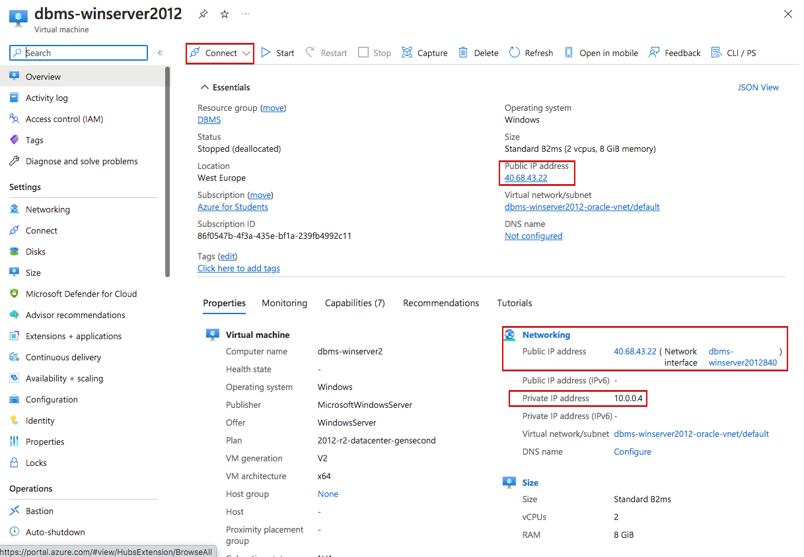
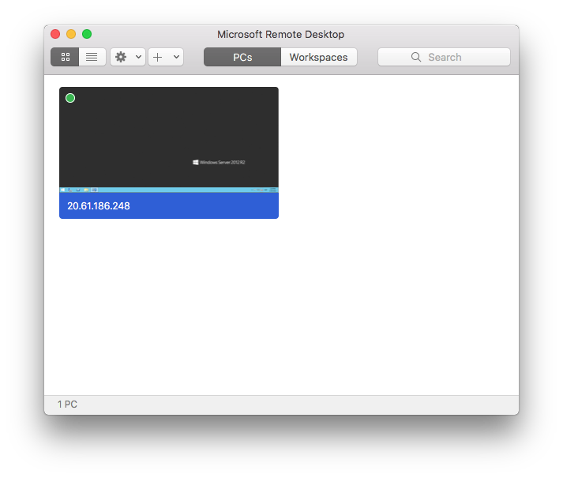

# Windows Server in Azure

In this note we will see how to create a Windows Server 2012. We will use that machine to install our Oracle Database afterwards.

First, we have to access the [Azure Portal](https://portal.azure.com/) using our Azure for Students Account.

In the next images we will display with a red square the options that have to be changed or revised. You can forget about the rest of available options.

Once logged in, we will create a new resource. 

As we are going to deply a Windows Server, let's find the available options typing down "Windows server" in the search bar.

Select "Windows Server"

Let's use Windows Server 2012 R2 Datacenter, that is the minimum Server available.

In the next screen, make sure that the "Azure for Students" suscription is selected. Create a new "Resource group" to allocate all necessary resources (virtual machine, virtual network, disks...)

Configure the "Project details" as shown. That is enough for our needs while keeping the costs down. The size can put up the costs quite a bit. Make sure that you select the proposed size. Don't keep the default.

Fill in the administrator account

Now we create the disk where the OS will be installed.

Finally, we create the virtual network. Let's keep the default options for now. We can "Revise and create" the resources now.

If all is correct the validation will be completed and we can proceed and create the resources. Make sure the costs ara similar to the ones shown in the image. If they are bigger, go back and revise the selected options.

The resources will be implemented and the machine will be created.

It could be a good idea to configure the automatic shutdown so the machine is shut down every night in case we forget to shut it manually to avoid innecesary costs.

Once the VM is created we will see all the information about it. It is interesting to check the private and public IP addresses, as we will need them to connect to the VM.

> ATENTION!
> 
> The public IP address could change. Make note of the new IP each time you try to connect to the VM.

We can now connect to our Windows Server using RDP protocol. It allows us to make a graphical connection to the machine. Make click on "Connect" and then select RDP.

Here we have all the necessary information to connect to the VM, the IP address and port.

We can now use a Remote Desktop software to make the connection. In lliurex we have KRDC and Remmina. We could also use Windows Remote Desktop in Windows or Mac.

## Connection using KRDC

In the following images we can see how to use KRDC to make the connection.

Just select protocol RDP and the public IP address.

We can configure some things, such as the screen resolution or keyboard. You can also make a folder in your hard disk available to your VM, the same way you use shared folders in VirtualBox.

It will then ask for the user and password.

And the connection will be stablished.

## Connection using Microsoft Remote Desktop

You can use Microsoft Remote Desktop in Windows and Mac.

As in KRDC we can have share folders between our computer and the Azure Virtual Machine, the same way we share folders in a virtualization software (such as VirtualBox).

Download the software for Windows from [Microsoft Store](https://apps.microsoft.com/) or for Mac in the [App Store](https://www.apple.com/es/app-store/).

Yo can quicky connect to the VM downloading the RDP file from azure and them make doble click on it.

But I advise to do it this other way to create a shared folder first. Open Microsoft Remote Desktop and go to menu "Connections -> Add PC".

Then follow the steps. Fill in PC name with the public IP address of the VM. In User account create a new one for the "administrador" user previously created.

In "Folders" tab, create a shared folder with your computer. First create the local folder. Then, use the "+" button to add it.

Next time you open the connection, you will find a network drive in your VM which is the local folder in your PC. It is a very convenient way to share files between both systems.

Once all configuration is finished you will find it in the main page each time you open the application.

> REMEMBER
>
> The VM public IP will change. You will have to edit the created connection each time you want to connect to the VM, but you will just have to change the IP address, keeping the rest of the configuration.

