# Windows Server in AWS Academy

In this note we will see how to create a Windows Server. We will use that machine to install our Oracle Database afterwards.

First, we have to access the [AWS Academy portal](https://www.awsacademy.com/vforcesite/LMS_Login) using our AWS Academy Account.

In the next images we will display with a red square the options that have to be changed or revised. You can forget about the rest of available options.

Once logged in, find the learner lab your teacher has prepared for this course. 

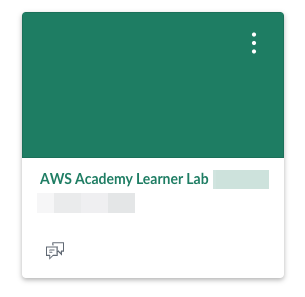

Select "Modules" to access the lab.

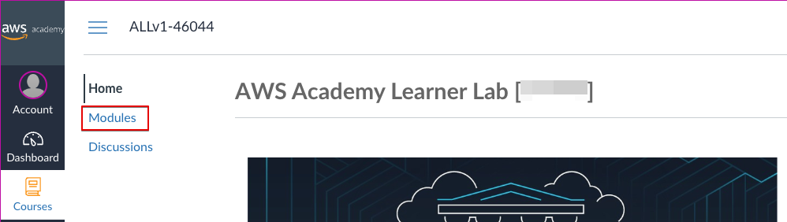

Open the "Learner Lab".

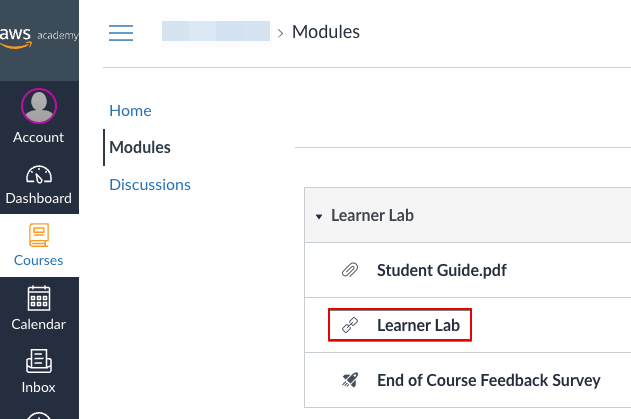

Start the lab:

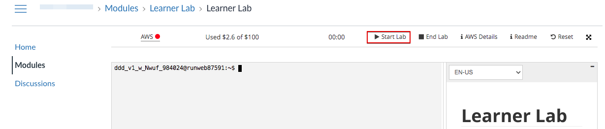

Once started you will see a green dot next to AWS. Click there to open the AWS console and start working.

Now you have access to the AWS console. Depending on your previous use of this console you might see different things on the screen.

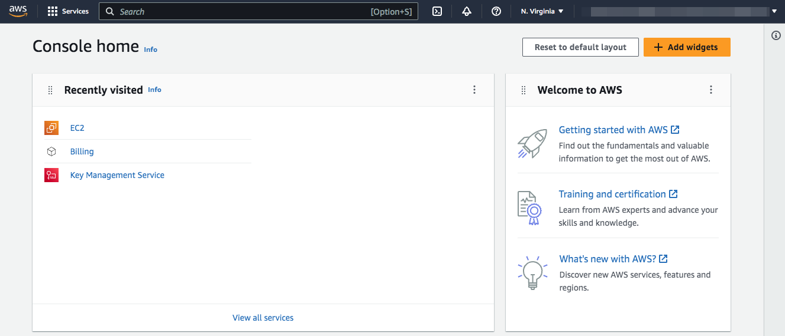

In AWS the Virtual Servers are called EC2. Let's start by creating one EC2 then. You can do it different ways. Let's see one of them. Scroll down to "Build a solution" and click on "Launch a virtual machine"

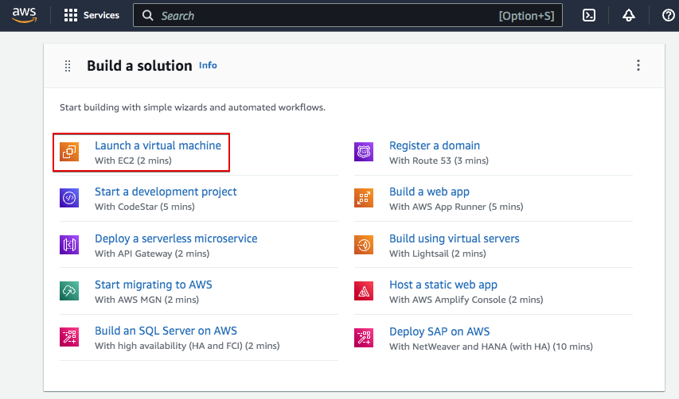

We have to give the parametres to create the machine. Follow the screens with the provided data.

A Windows Server 2016 will be enogh for us:

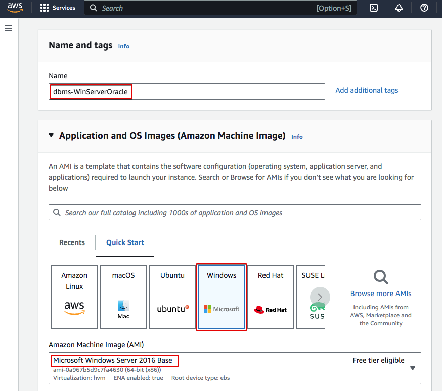

Oracle requirements are important. We can choose a t2.large instance type with 2 virtual CPU and 8GiB Memory.

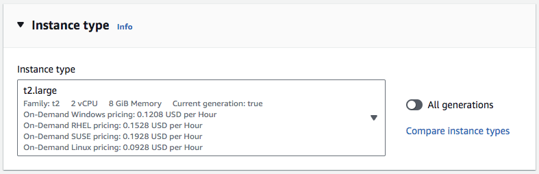

The Key pair (login) section is very important as here we will create the key pair that will allow us to remotely access the server. Let's create a new key pair.

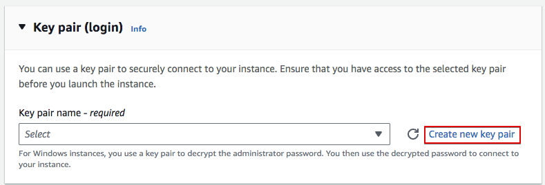

Make sure you store the key pair in your computer or you won't be able to access the server afterwards.

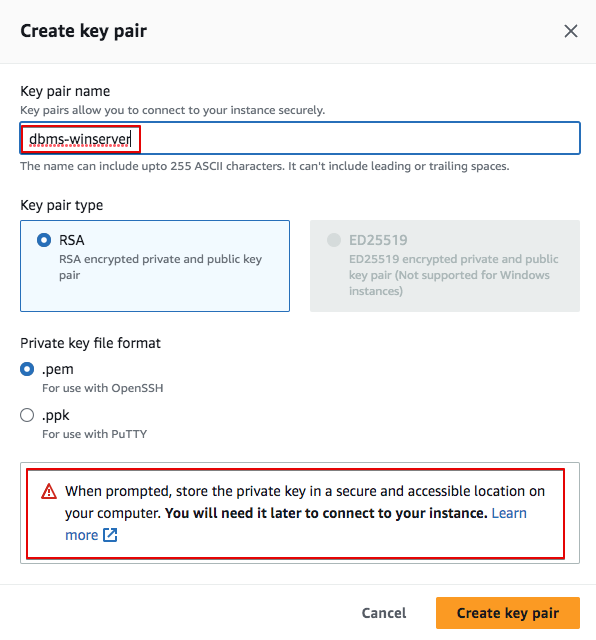

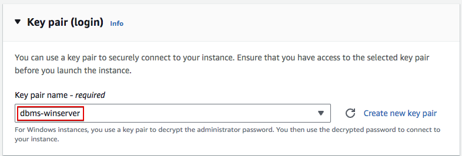

We have to define the network settings of our VM. We need to access it via RDP and later, access the Oracle console using https. Let's allow RDP, HTTP and HTTPS from the internet.

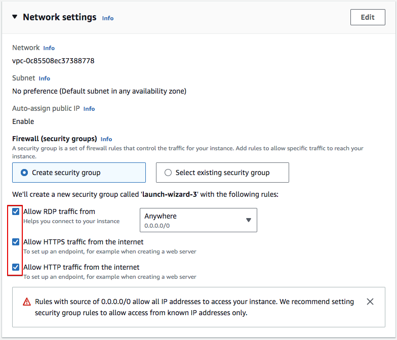

Finally, we have to configure the storage. Let's provide a 80GiB volume so Oracle can run smoothly.

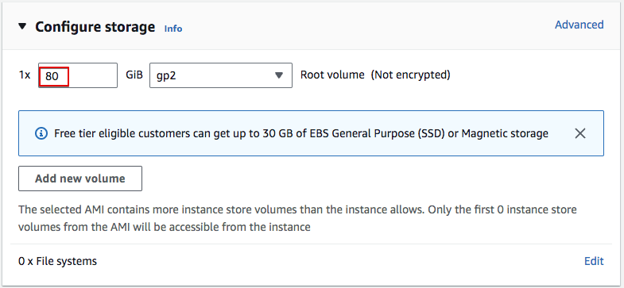

Check all the selected options and Launch the instance.
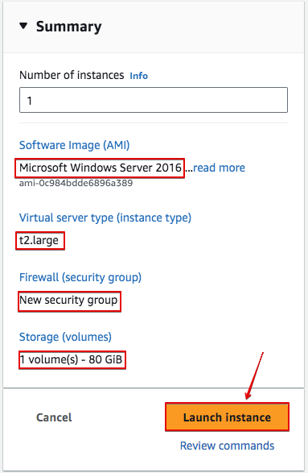

If all goes well the instance is created and we can now see it in the EC2 console.

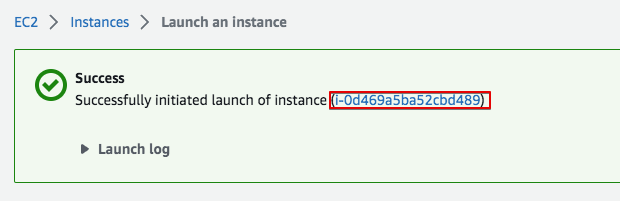

In the EC console we see that the VM is running and all realated data, such as the public IP address we will later need to access the OMS.

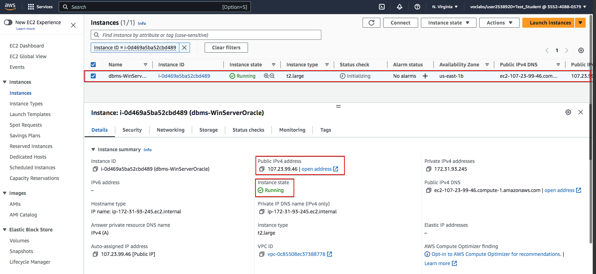

We can now access the server using RDP. First click on "Connect" to allow the connection. Select RDP client. And, first of all, let's get the Administrator password.

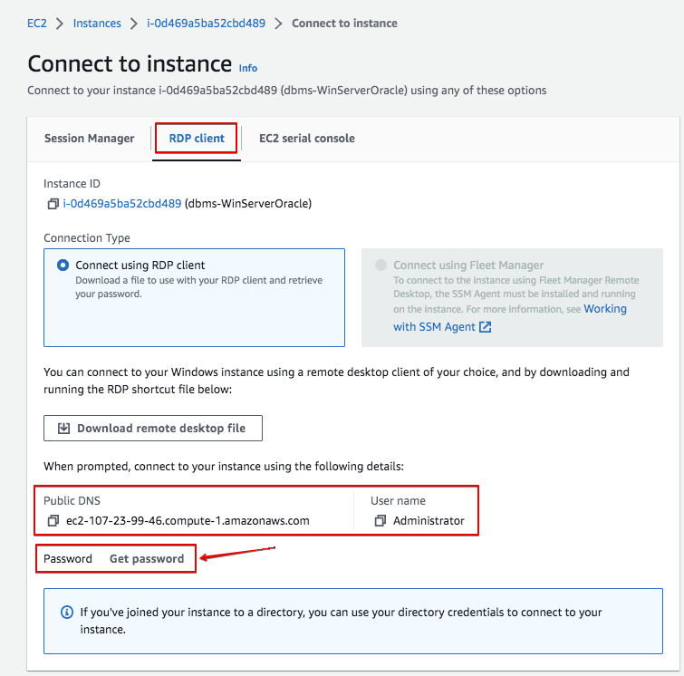

Remember the "key pair" I told you to store in your computer previously. That's the one you have to use now. Use "Upload private key file" and upload your stored "key pair".

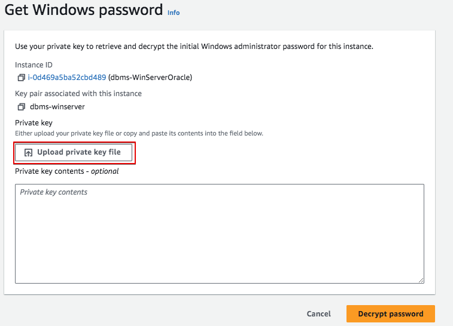

Once readed, you can "Decrypt passwod"

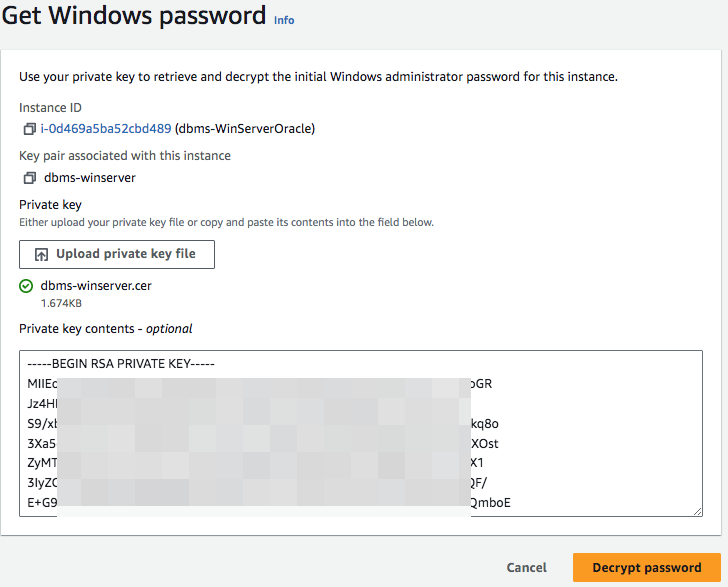

It will be a difficult to remember password. Just copy it and you can then change it from inside Windows server.

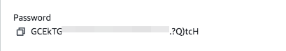

It is a good practice to create a text document and copy there all the information in the "Connect to instance" screen: Instance ID, Public DNS, User name and Password. 

We can now use a Remote Desktop software to make the connection. In lliurex we have KRDC and Remmina. We could also use Windows Remote Desktop in Windows or Mac.

Before yo connect to the server, just remember you have to finish the lab each time you finish working. Just go to the AWS Academy console and press "End Lab". If you don't do it the lab will be automatically closed after 4h.

## Connection using KRDC

In the following images we can see how to use KRDC to make the connection.

Just select protocol RDP and the public DNS (instead of the IP shown in the image).

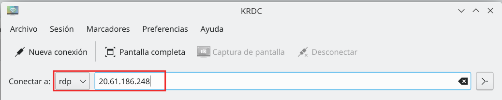

We can configure some things, such as the screen resolution or keyboard. You can also make a folder in your hard disk available to your VM, the same way you use shared folders in VirtualBox.

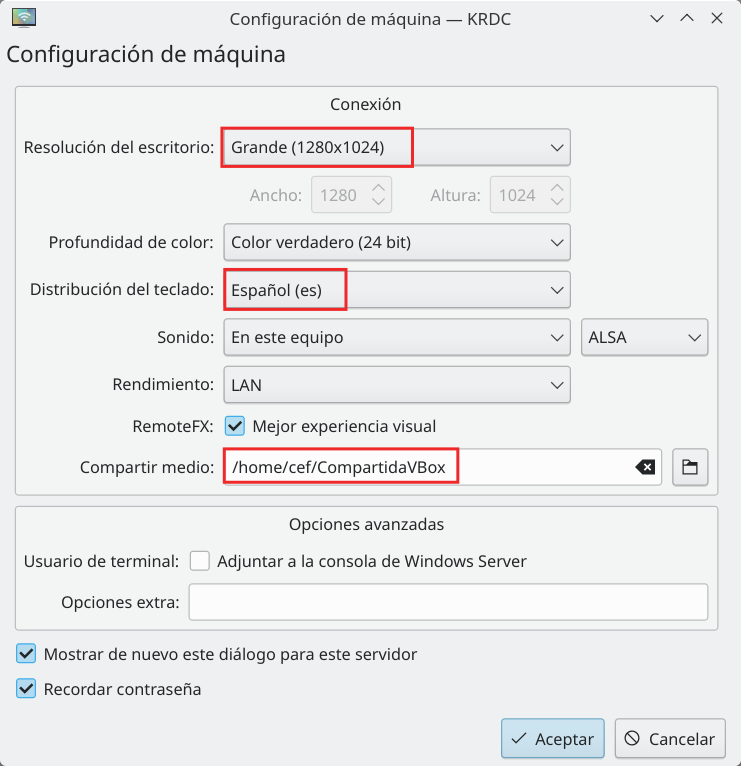

It will then ask for the user and password.

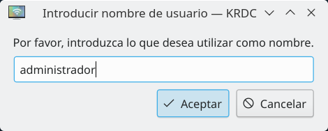

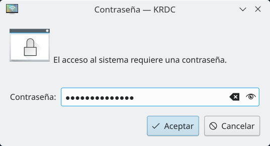

And the connection will be stablished.

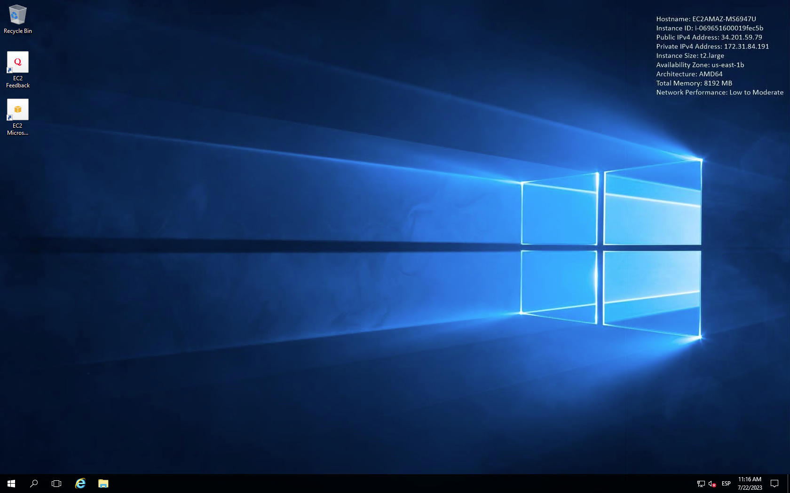

## Connection using Microsoft Remote Desktop

You can use Microsoft Remote Desktop in Windows and Mac.

As in KRDC we can have share folders between our computer and the Virtual Machine, the same way we share folders in a virtualization software (such as VirtualBox).

Download the software for Windows from [Microsoft Store](https://apps.microsoft.com/) or for Mac in the [App Store](https://www.apple.com/es/app-store/).

We can now "Download remote desktop file" to quickly access de Server.
Just download the RDP file from AWS and them make double click on it.

But I advise to do it this other way to create a shared folder first. Open Microsoft Remote Desktop and go to menu "Connections -> Add PC".

Then follow the steps. Fill in PC name with the public DNS of the VM. In User account create a new one for the "Administrator" user previously created with the Password retrieved.

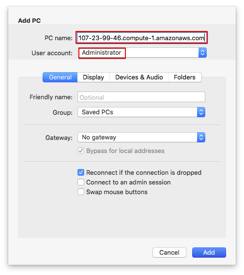

In "Folders" tab, create a shared folder with your computer. First create the local folder. Then, use the "+" button to add it.

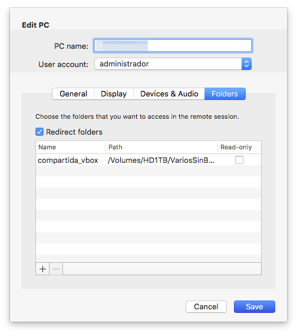

Next time you open the connection, you will find a network drive in your VM which is the local folder in your PC. It is a very convenient way to share files between both systems.

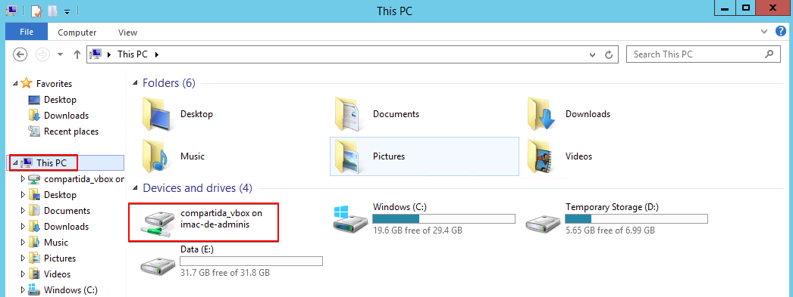

Once all configuration is finished you will find it in the main page each time you open the application.

> REMEMBER
>
> The VM public might will change. You will have to edit the created connection each time you want to connect to the VM, but you will just have to change the IP address, keeping the rest of the configuration.

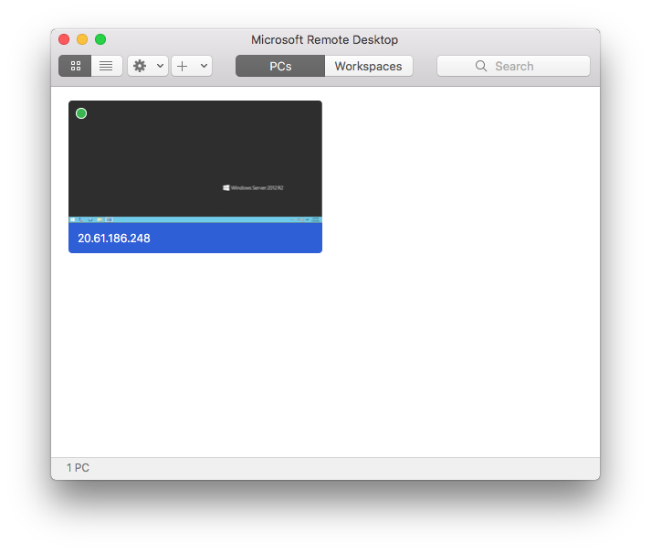

