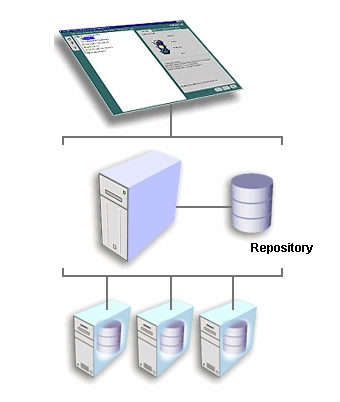
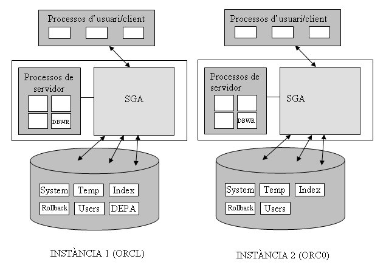

# Oracle DBMS basics.

## Objectives

Last year in Database Management module, Databases have been designed, translated into the Relational Model, and implemented either in Access or in Oracle. Access to the Database has also been made through the SQL language, both to retrieve information or modify it, and to create the Database itself (the tables).

Practical experience has also been gained in what the client-server architecture in Oracle consists of, but only from the client's perspective.

The objective of this unit will be to install and configure a large Database, such as Oracle. Specifically, these tasks of managing the Database include, among others:

- Know its basic structure.
- Install the Oracle Server.
- Start and stop the Database.
- Organize the physical space where the data is stored.
- Manage the objects directly.

## Functions of the Database Administrator (DBA)

The Database Administrator (DBA: DataBase Administrator) is the person responsible for the proper functioning of the Database, its installation, and correct operation. Among their functions we can find:

- Installation of the DBMS, and possible updates.
- System startup and shutdown, although this can be done automatically.
- Resource allocation: memory, hard disk, ...
- Authorize access to the DB by creating users who can access the database and specifying to which parts they do it. If there are many users, as many will have the same or similar permissions, they will have to be managed by groups (in Oracle, a ROLE must be created).
- Administration of the objects of the DB. Although users can create their own objects (tables, views, synonyms), there will be times when the administrator will have to manipulate them directly.
- DB Backup. These could be divided into partial and total backups. In case of information loss, the administrator will have to recover it.
- Optimize the system for better performance, both regarding the adjustment of the current system and improvements in hardware and software (tools).

We will see each of these functions throughout the unit, first with a short general description and then specific to Oracle. Even if any of these functions can be done in more than one way, we will try to see them all.

## Oracle DBMS estructure

Before exploring the functions of the Administrator in Oracle, it is convenient to know a little about its structure, how it is organized, to be aware of what we are doing.

In "smaller" DBMSs, such as ACCESS, all the tables of a specific theme (with possible queries, forms, reports, etc.) are stored in a single file. Therefore, a Database, understanding it as a set of related data belonging to a specific "universe," is saved in a file with an .mdb extension. In DBASE, each table was stored in a file, and the Database was all that was saved in a directory.

In ORACLE, many users can connect (it is therefore a "large" DBMS), and a Database (more specifically an instance, as we will see later) is the set of all the tables created by all users, including the administrators, who will have many tables at their disposal to manage everything.

In this sense, the closest to the conception of a Database as mentioned above (a set of related data belonging to a specific "universe") in ORACLE are users. It would be absurd to create an entire Database instance, with the work of administering it, for a Database of 10 tables. However, it is very reasonable for a user.

The tables of different users are stored on the hard disk in TABLE SPACES, which are sets of one or more physical files that are usually stored in the directory C:\Oracle\Oradata\nomBD, and the name of the (large) Database could be ORCL.

There are a few predefined table spaces to classify the different tables:

- System table space (system): this is where Oracle stores all the information it needs to manage itself. It's better not to touch it.
- Temporary table space (temp): where it stores temporary tables (which serve as partial results).
- Tools table space (tools): where tables used by different Oracle tools (Forms, Reports, etc.) are stored. If the tools are not installed, it will not be created.
- User table space (users): where users' tables are stored.
- Index table space (index), to store indexes (primary keys and secondary indexes); if they are in a different location than the data, it is more efficient.
- Rollback table space (rollback): stores information to undo transactions.

These would be the predefined ones, but using the appropriate tools, more table spaces can be created. It would probably be most convenient to create a table space for each large group of users (one for the accounting department, another for administration, etc.).

Each table space can consist of one or more files with a specific size. The name of these files is usually of this type:

- USERS01.DBF (indicating that it is file 1 of the USERS table space, and it will be located in the instance directory; if the name of the instance is ORCL, it will be in: C:\Oracle\Oradata\Orcl).

The administrator must ensure that there is enough space. Thus, suppose all users in a specific department share the DEPA table space. This table space only has one reserved file (DEPA01.DBF) of 20 Mb, and this space is almost entirely occupied. Then a new file (DEPA02.DBF) of 20 Mb can be assigned to the table space, for example. The capacity of the first file

The administrator must ensure that there is enough space. Therefore, let us suppose that all the users of a particular department share the table space DEPA. This table space only has one reserved file (DEPA01.DBF) of 20 Mb, and this space is almost fully occupied. Then, a new file (DEPA02.DBF) of 20 Mb can be assigned to the table space. Alternatively, the capacity of the first file could have been extended. However, it is not convenient to make them excessively large.

In short, table spaces are physical subdivisions of the Database.

Each user, in principle, can only see their own tables, the ones they create, unless we expressly grant permissions (grant). Even different users can give the same names to their tables (it is logical since if I only see mine, I don't know what name the others have, and I can give a repeated name). Now suppose that a user (U1) grants permission, on their table (T1), to another user. This second user, to be able to access the first user's table, will have to refer to it like this:

SELECT * FROM U1.T1;

Therefore, we have a logical subdivision of tables: by users (actually, Oracle uses the name SCHEMAS, schema). If I only put the name of the table, I am referring to one of my tables. If I want to refer to someone else's table (and I have permission to do so), I have to put their name first.

Each user can define more objects, apart from tables, such as views, index, synonyms (convenient way to refer to a table). All of this will be part of your schema, which by default will be stored in a single TableSpace (except temporary objects).

Besides the tablespace data files, there are other files that are kept in the same directory that are also basic. The control file (usually CONTROL01.CTL) is a file where critical information is kept, such as the location of data files. If it was damaged, the instance could not even be booted. As it is so important, it is common to have two identical or even three (CONTROL02.CTL and CONTROL03.CTL)

Other important files are transaction logs, also called "redo" logs (redo log files). There are a minimum of 2 files (REDO01.LOG and REDO02.LOG), although by default 3 are created. The last transactions are saved in them, although you can make it save all transactions since it was created the Database (obviously not in 2 files but in many: it will be the ARCHIVELOG operating mode, which we will see later).

And for the last concept a little introduction. Different processes will want to access the Database. Thus, many users can have a SQL*Plus connection, and others a connection from another tool. Each of these connections is a user process. And in the same way that there are user processes, there are also server processes, which access the Database in order to manage it. More specifically, user processes make requests to server processes and these are the ones that access the data. An example of a server process is the database writer (DBWR) which is responsible for writing the modified data blocks in the database files.

But as memory is much faster than disk, Oracle mounts a kind of cache area to optimize performance. It is the SYSTEM GLOBAL AREA (SGA), which contains 4 fundamental components: Data buffer cache (where the last accessed data is stored), Dictionary cache (where the last dictionary data is stored which have been accessed), Transaction Log Buffer (last updates made) and SQL Cache (where the last SQL commands executed are saved). All processes (except those that need to move physical file information from tablespaces to caches and vice versa) will access the SGA, and not directly to the hard disk. Therefore the SGA is the great communication area of the Oracle. Obviously, it suits us that all or almost all of the SGA is in central memory.

On the other hand, the GLOBAL PROGRAM AREA (PGA) is an area of memory used by a single process that it does not share with any other. There will be a PGA for each process of each user running.

An ORACLE INSTANCE is a SGA with some system processes (that access it) and a set of files (of tablespaces) also associated. In other words, an instance is a "running" Database. Two different instances will have different SGAs, with different system processes, and DIFFERENT DATA FILES. Therefore, for all intents and purposes, two Oracle instances (even if they run on the same machine) are two different Databases, which must be administered separately. The name of the first instance on a machine, by default, is ORCL. All files associated with it (data, control, ...) will be saved by default in a directory called C:\ORACLE\ORADATA\ORCL. A second instance on the same machine could be named ORC0 , and all files associated with it could be stored in a directory called C:\ORACLE\ORADATA\ORC0.

The following figure illustrates what instances are:

