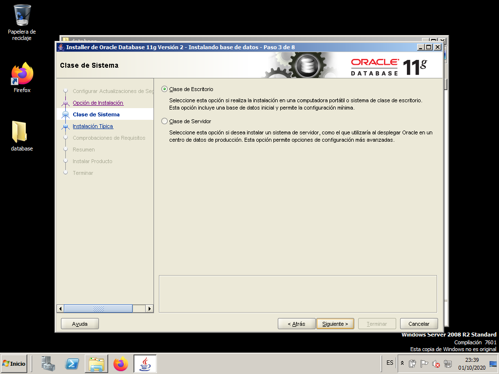
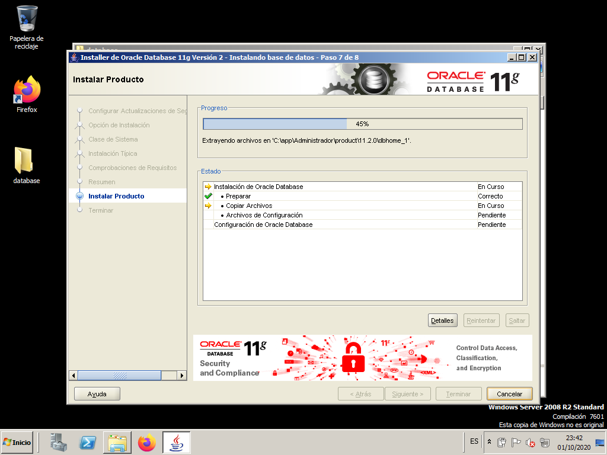

# Oracle installation.

The installation process of the entire DBMS will consist of installing the server, that is, the Database itself, and also installing the clients on those machines that users will use to connect to the Database. It will also be necessary to make the connection between client and server possible.

We could also include in this section the installation of different help tools both on the server and on the clients (as they could be in the case of Oracle Developer, to build applications with forms and reports).

## Oracle Server installation

> We are going to work with **Oracle 11g**, an old version of the DBMS, as in the moment of writing these notes[^1], the latest long term release is 19c and the innovation release is 21c. 
> 
>The main reason is that its hardware and software requirements are smaller than the newest versions and the DBMS administration concepts we will learn are quite similar.

[^1]: March 2023

Before we start we will need 

- Windows Server (64 bits) OS (2008 or higher)
- Oracle 11g Server for Windows

You can download a VirtualBox .ova virtual machine and the Oracle 11g Server [here.](https://gvaedu-my.sharepoint.com/:f:/g/personal/j_munozjimeno_edu_gva_es/Ep5R9IIvqjpGiz0FmLGjPWkBRnE9Kb8PAeiOVoqrlTzd1A){:target="_blank"}

When we start the machine it should look similar the following image.

Next you have to download the .zip file with Oracle Database 11g Release 2. Unzip it on the Desktop so that it looks like this:

Launch the setup.exe file to begin the installation.

Do not provide any data on this screen and ignore the warning message.

Select the first option so that after installing the Oracle software a database is configured.

Choose the "Desktop Class" option since we are not going to work in production.

At this point the only thing we are going to fill in is the "Global Database Name". Fill it with "orcl.w2008". As Administrator password and its confirmation use "system".

Ignore the warning message and proceed with the installation.

This informative screen helps us check that the installation options are correct. Click "Finish" to begin the installation process.

At this point the installation process begins...

When finished, the "Database Configuration Wizard" creates the instance that we had previously configured.

When the wizard finishes, we press "Password Management..." to edit and unlock a few users.

We change the password of the user "SYS" and of the user "SYSTEM". In both cases we use "system" as the password.

We unlock the user "SCOTT" and the user "HR".

* SCOTT: password "tiger".
* HR: password "hr".

We ignore the warning about password strength.

Take note of all the information provided in this screen, as you will need it later. The SID (System IDentifyer) is orcl and wi will later need it to connect to the database.

We press "Accept" and we will have finished the installation.

In earlier versions of Oracle the main tool to manage it was a program called *Enterprise Manager Database Control*. In Oracle 11g it is no longer an application but we can access this tool as a web page and it is called *Oracle Enterprise Manager 11g*. In this last screen we see the url that we must put in the browser to be able to manage the created database (orcl).

The address is: [https://localhost:1158/em](https://localhost:1158/em){:target="_blank"}

We will get into this tool in the next section.

> *Orace Enterprise Manager 11g* uses TLS 1.0 and 1.1. which are disabled by default in web browsers nowadays. You will have to find out how to enable them in the browser you select. In Mozilla Firefox last versions you can learn how to do it [here](https://support.mozilla.org/en-US/questions/1101896){:target="_blank"}.

### After the installation

Once the installation is completed, we will have, among others, the following elements in the Windows Start menu:

- Oracle - OraDb11g home1
  - **Database Control - orcl**. It will open the Oracle Enterprise Manager 11g accessing the https://localhost:1158/em web page in our system web browser.
  - Application Development
    - **SQL Plus** - SQL statement editor
  - Configuration and Migrations Tools
      - Database Configuration Assistant. Allows us to create new instances of databases, delete them, or modify the configuration of an existing one.
      - Database Upgrade Assistant. Assistant for upgrading instances from previous versions of Oracle to the current one.
      - Oracle Administration Assistant for Windows. Assistant for confOKiguring the Oracle Management Server, a tool that will allow us to administer not only our server but also others on the network.
      - Net Configuration Assistant. For connecting to the server and making the server "listen" to requests.
      - Net Manager. It also allows us to configure network-related things.
- Oracle Installation Products
  - Universal Installer. To add or remove modules.

### Users

Once everything is properly installed, including the Database Instance, there will be several users created. We are mainly interested in 3. We already know the first one:

- **SCOTT** (password TIGER): as we already know, it is a normal user for testing.
  
We will also have 2 administrators. During the installation, we set the password for both:

- **SYSTEM** (password SYSTEM): is the normal administrator we will use.
- **SYS** (password SYSTEM): is the super-administrator. It is the only one with SYSDBA privileges, and when we connect to it, we will have to choose the SYSDBA connection mode. There will be tasks that only this user can do.

Depending on the administration task, we will connect as one or the other, always keeping in mind that SYSTEM must connect as a normal user, and SYS as DBA (Connect as SYSDBA).

## Tools to manage the DBMS

There are three ways to manage Oracle databases.

### Command Line Mode
The first way, which has traditionally been used, is in command line mode by giving SQL commands from SQL Plus (or similar). The connection to SYSTEM will be as usual, while the connection to SYS, as we have to do a Connect as SYSDBA.

We could also make the connection as SYS once we have entered SQL*Plus, by doing CONNECT SYS AS SYSDBA. In the image, we have an example where we first connect as SYSTEM, and then as SYS. Note that they will not have access to the same things.

### OEM - Oracle Enterprise Manager
The other way, which appeared starting from version 7.3, is the Oracle Enterprise Manager (OEM). It is the most convenient way to manage the DBMS, with a completely graphical environment. In the version we use (11g), we will do almost everything from the Enterprise Manager Console.

We can open it either using the link in the start menu or opening a web browser and typing the oem address in the navigation bar.

- Start menu
  - 

- Browser
  - 

Just remember that if you try to log in as System you do it as a normal user but, if you log in as Sys you have to do it as Sysdba.

### SQL Developer

We will usually install this tool on a different machine, not in the server, but in our test environment we will install it first on the server to learn how it works, and later install it on a different machine.

First, we have to download the last version from oracle web page. We can find it [here](https://www.oracle.com/database/sqldeveloper/){:target="_blank"}.

We select the "Windows 64-bit with JDK 11 included" as it has the necessary Java version included.

In our server we open the download page and we get the install program. We need an Oracle account. You can also get it [here](https://gvaedu-my.sharepoint.com/:f:/g/personal/j_munozjimeno_edu_gva_es/Ep5R9IIvqjpGiz0FmLGjPWkBRnE9Kb8PAeiOVoqrlTzd1A){:target="_blank"}, even though it might not be the last available version.

This archive includes both SQL Developer and an embedded copy of the Java 11 Development Kit (JDK). Simply extract the zip to a fresh directory and run the sqldeveloper.exe in the top directory. The EXE is configured to run the embedded JDK by default.
thenthen
You can put it in ""C:\Program Files\Oracle\sqldeveloper" and create a shortcut in the Desktop for easy access.

To connect to the server just double click on the .exe file or the created shortcut. 

> If you are on a Windows 2008 Server you might get an "*API-MS-WIN-CRT-RUNTIME-L1-1-0.DLL*" error. To solve it just download and install Visual C++ for Windows. You can find it [here](https://www.microsoft.com/es-es/download/details.aspx?id=48145){:target="_blank"}.

When it opens you will see this.

Let's make a connection to the server as user SYSTEM. First click on yhe "+" to create a new connection.

Then fill in the necessary information (pay attention to the SID, as we have to change it for "orcl" that is the one we defined during the installation process). Then click on "Test" button and check that you get the "Status: Success".

Then you can press the connect button to connect to the server. Check that the connection has been stablished.

