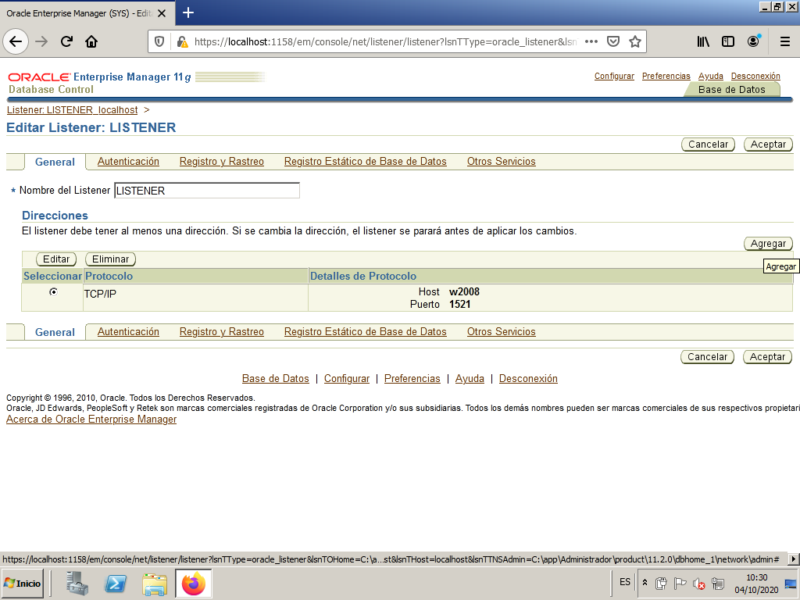

# Oracle connection

In the previous notes we have installed the Oracle Server and the tools we can use to connect to the database in the same machine:

- Command Line Mode
- OEM - Oracle Enterprise Manager
- SQL Developer

But in a real situation we as database administrators will not be directly connected to the server, but rather on a completely different computer in our office far away. We are going to see in this section how to connect to the database in this situation. We will see it in order of complexity.

## Connect using OEM - Oracle Enterprise Manager

As we saw in the previous section, in Oracle 11g the OEM is a web page we can access using any web browser. So it shouldn't have to be difficult to connect to it. When we were directly connected to the server we used this address "https://localhost:1158/em", so now, in a different computer we just have to change the IP address from "localhost" to the public IP address of the server. The way to get the IP address can be different if we have our server in Azure or on a local VirtualBox VM. Read the following section that fits your situation. You can ignore the other one.

**VirtualBox VM**

In this case you have to make sure to select your network adapter as "Bridged adapter".

When you run the VM you will see the IP address just keeping the cursor over the network icon in the down right area of the window.

**VM in Azure**

If your VM is in Azure we saw how to get the public IP address when we created the VM. Just to remember it, it is in the VM page.

Well, we already have the public IP address in either case so we continue the same way no matter where the VM is located. We just have to open a web browser in our computer and go to: "https://*publicIPaddress*:1158/em" changing *publicIPaddress* for the IP of the server. If we do it, we will probably get nothing. That's because the server firewall is blocking the connection. We have to open this ports:

- TCP 1158
- TCP 1521

Open the server and find "Windows Firewall". Create a new "Inbond rule".

Open by port.

Open those TCP ports

You can leave the rest of options without changing anything. Give the rule the name you want.

Now try to open the OEM again in your web browser.

> Remember *Orace Enterprise Manager 11g* uses TLS 1.0 and 1.1. which are disabled by default in web browsers nowadays. In Mozilla Firefox last versions you can learn how to do it [here](https://support.mozilla.org/en-US/questions/1101896){:target="_blank"}.

Once the TLS problem is solved you will have access to the OEM.

**VM in Azure**

If our server VM is located in Azure we will see that we cannot reach the OEM yet. That is because Azure has its own "firewall" that is called "Network Security Group - NSG" where we have to open the ports. We first go to "All resources" and we see the NSG for our server

Click on it to see the NSG configuration. We see that the RDP port is already open, to allow the RDP connection. Let's go to "Settings" and click on "Inbound security rules"

Now click on "+ Add" to add a new rule.

Configure the rule to allow connections to 1158 and 1521 TCP ports. Give a name to the rule.

Check that the rule has been properly created.

Now you shuld be able to connect to the OEM in the server.

## Connect using SQL Developer

To connect using OEM there was no need no install any SW. Now you have to install SQL Developer and you have to decide if you want to install it on a VM or directly in your computer.

We saw when we installed the server how to install the SQL Developer. Just remember:

- Download the last version from oracle web page for your OS. You can find it [here](https://www.oracle.com/database/sqldeveloper/){:target="_blank"}.
- Follow the installation instructions in that page.
  - If you want to install it in an Ubuntu Linux you can find detailed instructions [here](https://dev.to/ishakantony/how-to-install-oracle-sql-developer-on-ubuntu-20-04-3jpd){:target="_blank"}
- Once installed, open the application.

Once the SQL Developer is opened we have to create a connection to the database. There are 2 ways of doing it:

- Basic connection
  - Existing from version 10g. Very comfortable. The server address, instance name, username and password must be specified. 
- TNS connection 
  - Transparent Network Substrate. It is the one that has traditionally been used by Oracle. It's a very solid connection.

### Basic connection.

Let's create a basic connection from SQL Developer. First, click on the "+" to create a new connection.

Fill in the required information. Connect as user scott (password "tiger" remember) and change the IP address for your server IP address.

The necessary parameters in this case are:
* Connection name: orcl
* User: scott
* Password: tiger
* Connection type: Basic
* Hostname: IP of your server
* Port: 1521 (already open on the server)
* SID: orcl

We press `Test` and we check that the "Status: correct".

Now we can connect to the database.

### Listener configuration

It might happen that the test status is not correct, but something like this.

If we read the message it gives us a clue of what is happening. It has to do with the "Listener". Let's open a OEM window to solve it.

In order to connect from the client, we must configure the listener to accept requests that are addressed to the server's own IP.

We do this by connecting to Enterprise Manager with the SYS user as SYSDBA. From the main screen we enter `LISTENER_localhost`.

We edit the listener.

It is asking us for a user and password, In this case it refers to the operating system user and pass, that is, the user we use to login in the Windows Server. We gave it "administrador" when we installed the server.

We add a new address.

We put the server IP and keep the default port.

We now have two addresses in the listener which means that is going to accept connections addressed to localhost and the externar IP address.

We confirm the changes and restart the listener that's it.

We can now test the connection again in SQL Developer and now it should work.

## Other connection methods.

In the previous sections we have seen how to connect to the database using OEM and SQL Developer basic connection. There are other ways we can make the connection:

- SQL*Plus
- SQL Developer usin TNS connection

We will not see these methods in this course but if you are interested to try them, you have to install some SW first.

If you just want to try SQL\*Plus, you can get it from [Oracle Instant Client download page](https://www.oracle.com/database/technologies/instant-client/downloads.html){:target="_blank"}. Just select your platform, and the following screen, the SQL\*Plus Package.

Once installed connect using the information in [this page](https://xulioxesus.github.io/jekyll/update/2020/10/04/sqlplus-desde-cliente.html){:target="_blank"}.

To make the TNS connection you have to first create the tns file with all the information needed. To create that file you can use the "Net Configuration Assistant". To get it you have to 

- Go to the [Oracle Database Software Donwloads](https://www.oracle.com/database/technologies/oracle-database-software-downloads.html){:target="_blank"}.
- Select your version and platform and click on "See all" on the right.
- There you find the "Oracle Database XX client"
- Download and install it following the  instructions provided.

Once installed you have how to create the TNS connection in [this page](https://xulioxesus.github.io/jekyll/update/2020/10/03/sql-developer-nueva-conexion.html){:target="_blank"}.