# Start and stop Oracle. Basic administration

Usually the booting of all DBMS is automatic. When the Operating System starts, it starts the Database Engine. The stop is also automatic. In any case, it is convenient to know the usual steps to start and stop it.

We will also take the opportunity to see other things that can be done with the Instance Manager, such as changing parameters, managing sessions connected to the Database, etc.

## Start and stop with Oracle Enterprise Manager OEM - Instance Manager

We have to enter OEM as user **SYS**, and connecting as SYSDBA.

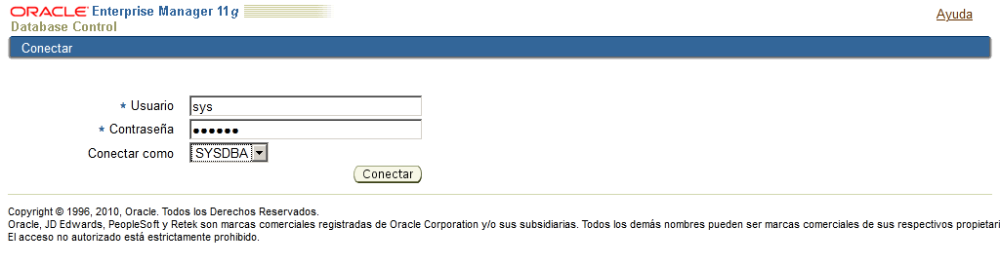

### Stop de database

In the "Home" tab choose "Shutdown". 

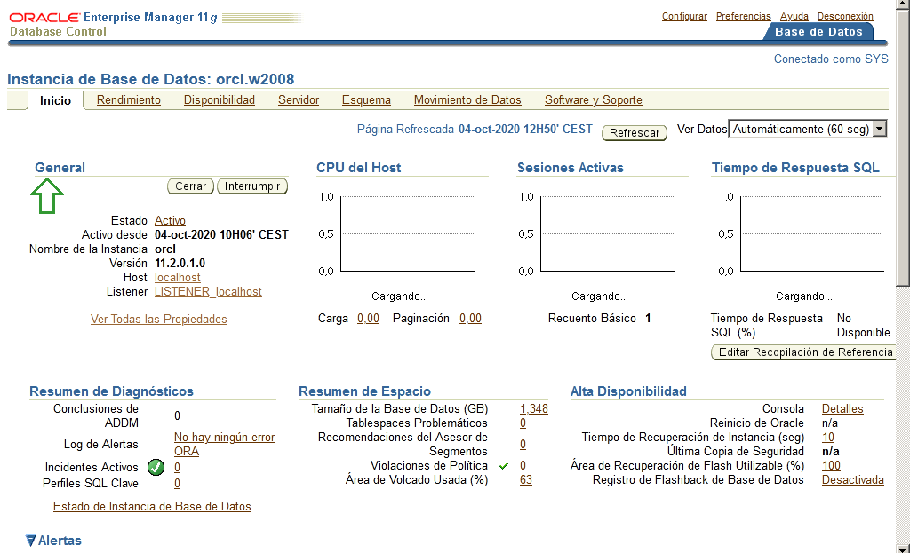

Then it is going to ask you for "Host Credentials" and "Database Credentials". The first ones are the operating system user and pass, that is "administrador" and the pass you selected. The others are the database user and pass, that is user: sys and pass: system, and connect as Sysdba.

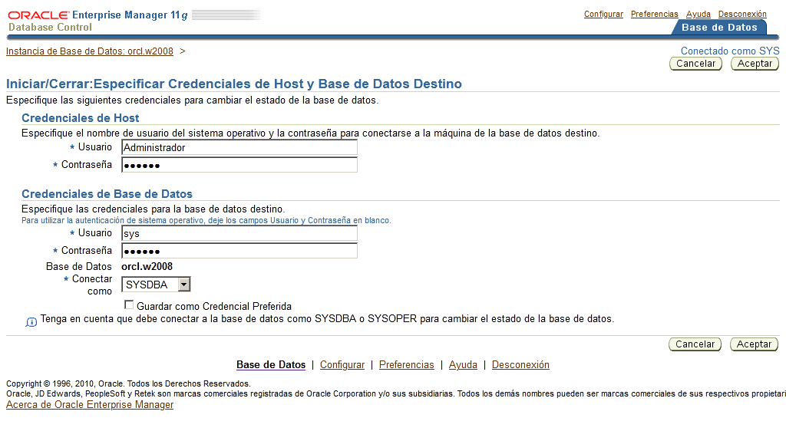 

Now press the `Advanced Options` button.

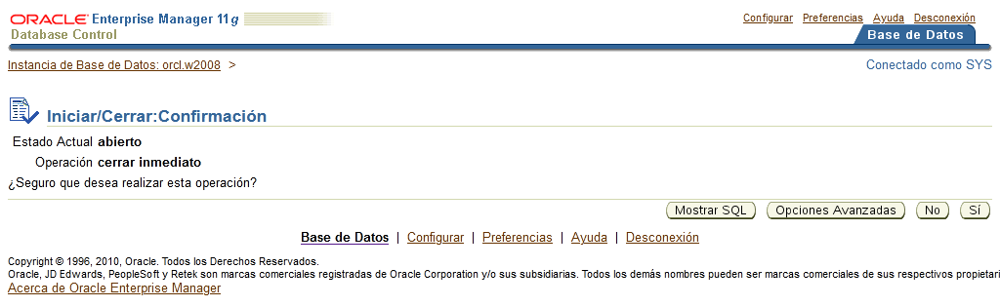

We will have 4 ways to do it, which are ordered from least to strongest:

- Normal: Wait for all users to log out, then close the database
- Transactional: Wait for users with pending transactions to Commit or Rollback, then close the sessions and the database
- Immediate: closes sessions automatically, rolling back all transactions, and then closes the B.D.
- Abort: close the database in a fulminating manner. It is not advisable to be too strong.

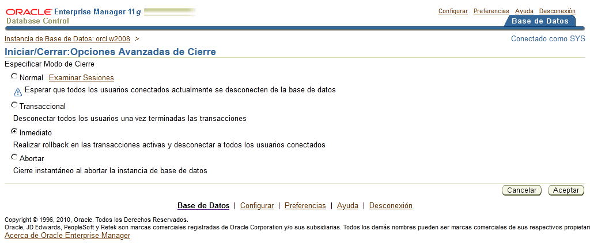

The most advisable is the third, since some users may take forever to close their sessions. We accept and we return to the previous screen. Now press `Yes` and the system informs us that is being shutdown.

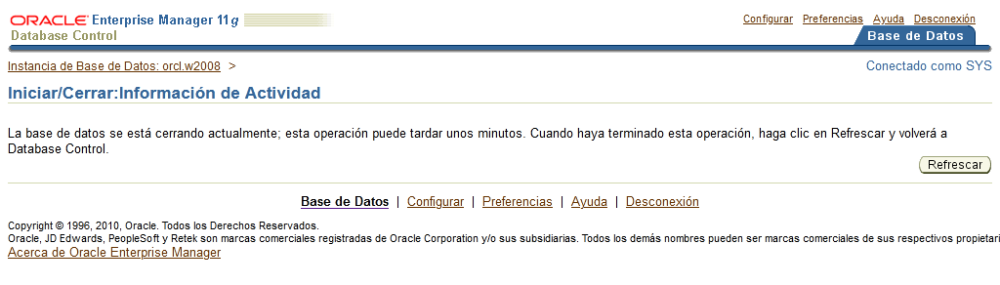

After a while (don't try it immediately) press `Refresh` and go back to the main screen. You can see how the database is shutdown now.

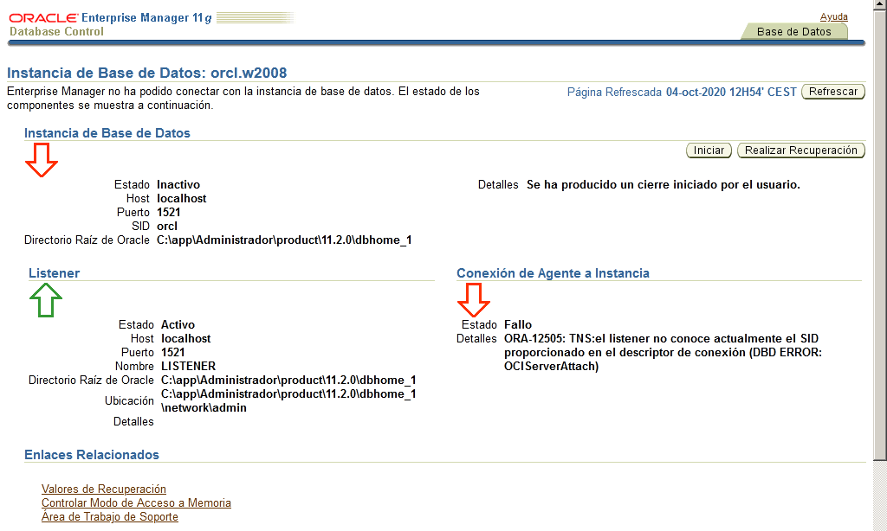

### Start the database

The steps that Oracle actually needs to boot are 3:

- **Startup**: Starts the instance. This involves the allocation of memory for the SGA and the initiation of system processes, the so-called background processes (they are in the background, without us noticing them). Also at this point the parameter file, which in earlier versions of Oracle is called INIT.ORA, is used to start the instance. From version 9i, in addition to the INIT.ORA parameter file, the Server Parameter File (SPFile) can also be used, which allows the server to be started even if the command is given from another machine (and in principle not INIT.ORA parameter file would be available). This SPFile is named SPFILEORCL.ORA (if ORCL is the instance SID). This is a non-editable file. The Startup state is also called **NoMount**.
- **Mount**: Mount the Database. This involves opening the control file, which is a file that has critical information for the database, such as its own name, when it was created, and the name and location of all files that are used when it is working. It's so important that it's even a good idea to have a backup control file that works as a mirror (in fact Oracle creates 3 by default).
- **Open**: open the database. The actual database files will open. When this phase is completed, you can access the Database and use its objects.
  
In the **NoMount** or **Mount** phase, that is the first two states, only the DBA can connect to the Database, to perform administration tasks.

Apart from the automatic start and stop (the usual) with which the three steps are always done, unless there is a problem, let's see how to do it manually with the administrative tools.

In the previous state, with the database shutdown, we press on `Startup` to start it again.

We have to provide the Host credentials and Database Credentials again. 

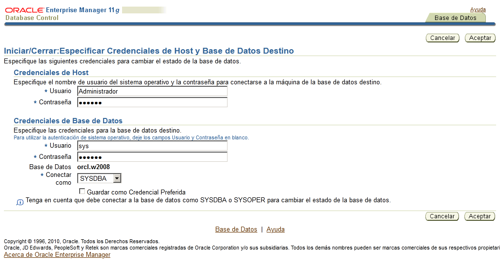

We get a screen to Start/Stop the database informing us that it is closed and the operation to do is start it.

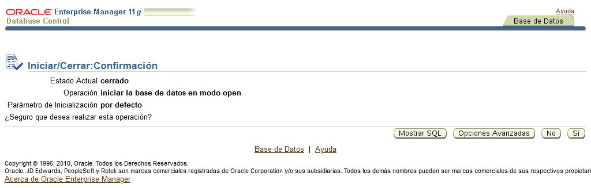

As in the shutdown process, we can press the `Advanced Options` button to get the different forms to start the database to reach various states we have previously seen. But normally we will select the third one, "Open the database"

In "Other Startup Options" we can select if we want restricted access to the Database only to administrative personnel to perform administrative tasks, such as to make a backup. 

In this screen, it also allows us to start by taking the parameters from a parameter file (pfile) instead of the default initialization parameter. That way we can specify a parameter file modified by us. But we must note that this file must be located in the server and we have to provide the full path to the file within the server.

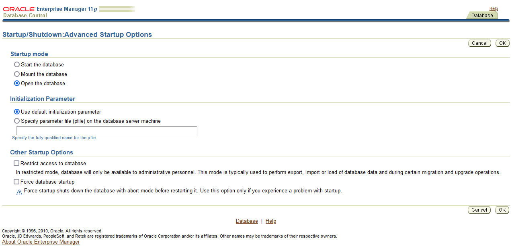

Let's press OK to go back to the previous screen. Now press `Yes` to start the database. Now wait a bit for the database to be opened.

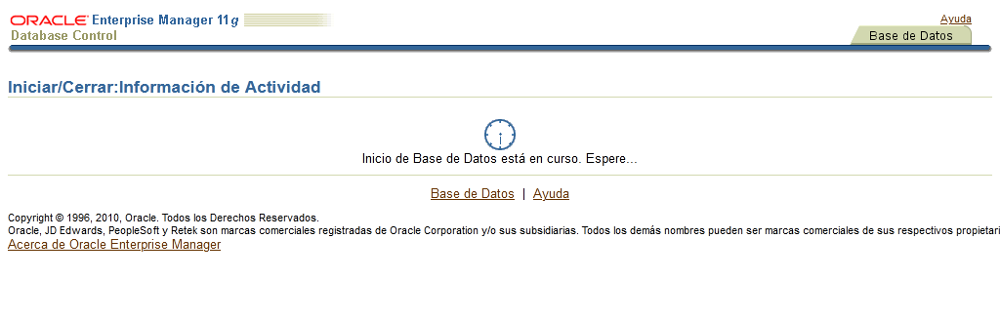

We get a login screen again.

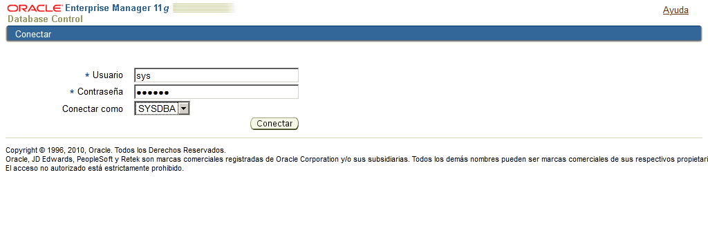

And we have our database opened again.

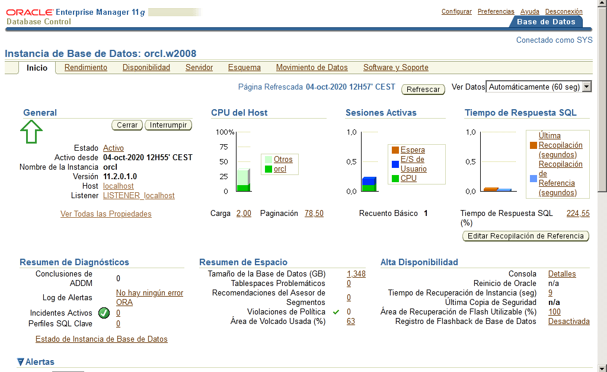

## Information and parameters

Appart from starting and stopping the database there are other basic administration tasks that de DBA administrator has to do complete.

One of them is to control the memory usage. Before you continue, revise the initial section in this unit to remember what the SGA and PGA are. Basically the SYSTEM GLOBAL AREA (SGA) is a kind of cache area that Oracle mounts to optimize performance. There is one SGA for each Oracle instance running in the server. On the other hand the GLOBAL PROGRAM AREA (PGA) is an area of memory used by a single process that it does not share with any other. There will be a PGA for each process of each user running.

To see and modify how the SGA and PGA are being used go to OEM "Server" tab, and then "Memory advisors"

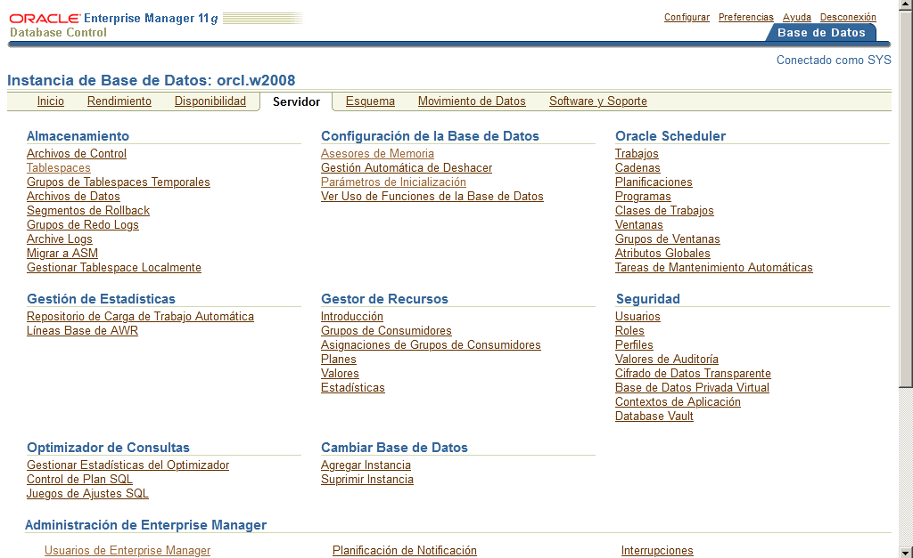

We can see that the Memory Management is automatic, but we could change it to manual, if need be.

There is a tab for the SGA

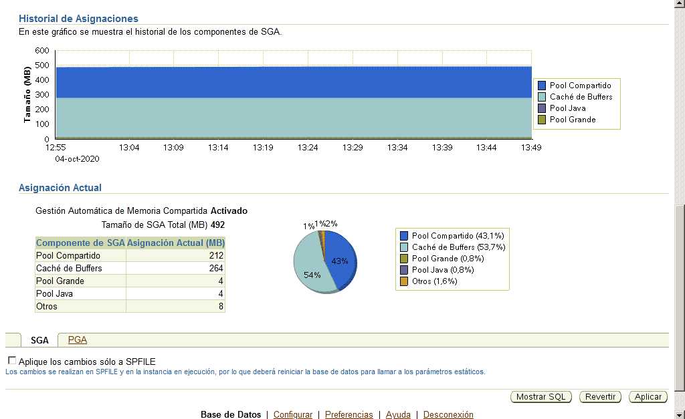

And another one for the PGA.

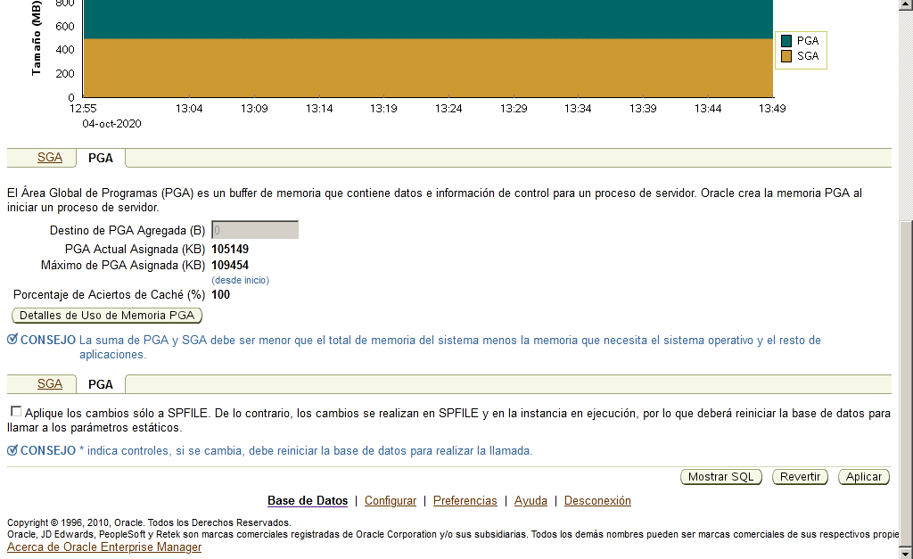

Dedicate some time to see the different options in this screens and how you should make changes to the allocated memory for SGA and PGA.

### Initialization parameters

Initialization parameters can also be viewed. Go to "Server" and then to "Initialization Parameters".

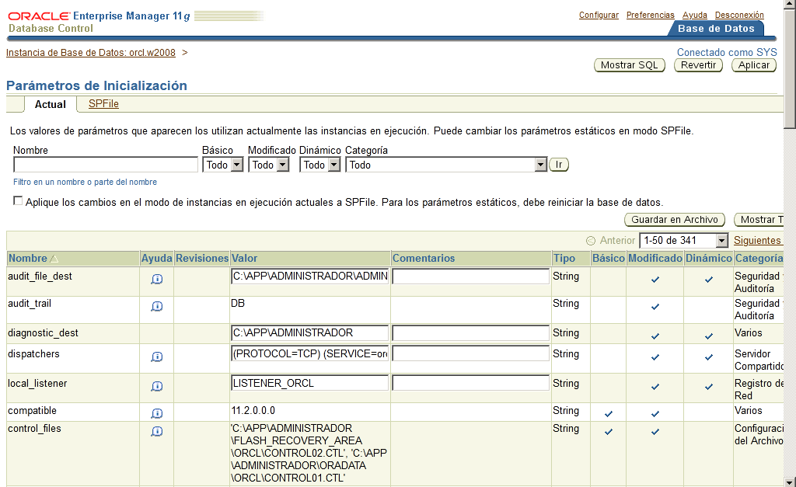

The parameters can be modified, and some of these, the dynamic ones, the modification will immediately take effect. But the modification of the non-dynamic ones will not take effect until the instance is restarted. In these cases, when the Apply button is pressed, an attempt is made to stop and restart it.

And we must not forget to save the parameters file if we want the changes made to take effect if we restart the database.

## Session management

You can also manage the sessions connected to the instance, to see the characteristics of the session and even to close them if we want. Among other things, it tells us the connected users, as which user of the Operating System they have authenticated, the name of the machine from which they have connected and through which program.

To see the stablished connections go to "Performance" tab and then to "Search sessions"

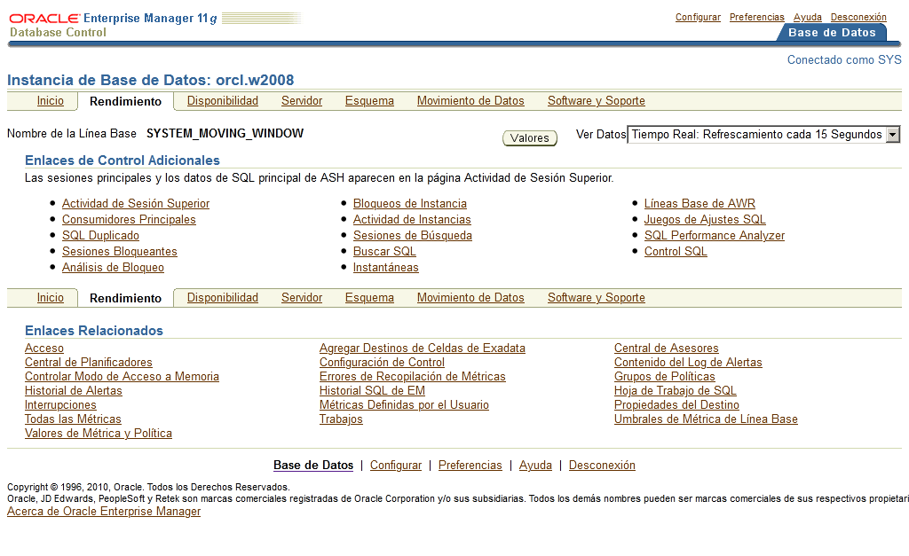

We can specify search criteria if we are looking for specific sessions, but if we just want to see all of them, just clic on `Go`.

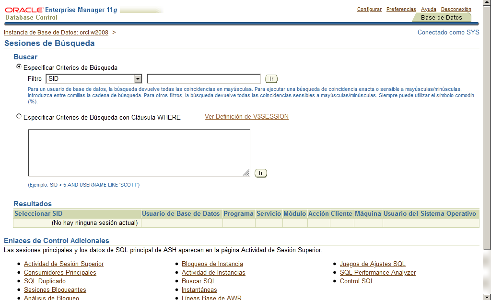

In the image you can see a SCOTT session made using SQL Developer, apart from system processes.

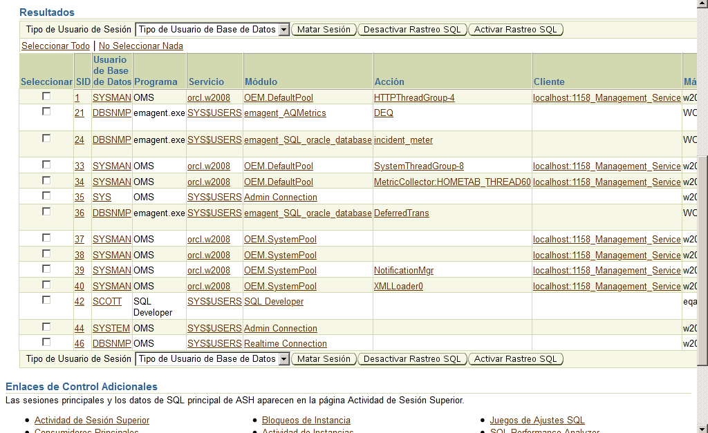

Also, the SYS and SYSTEM users have connected from the same server machine.

To disconnect the SCOTT user we just have to select the sessioin and press `Kill session`.

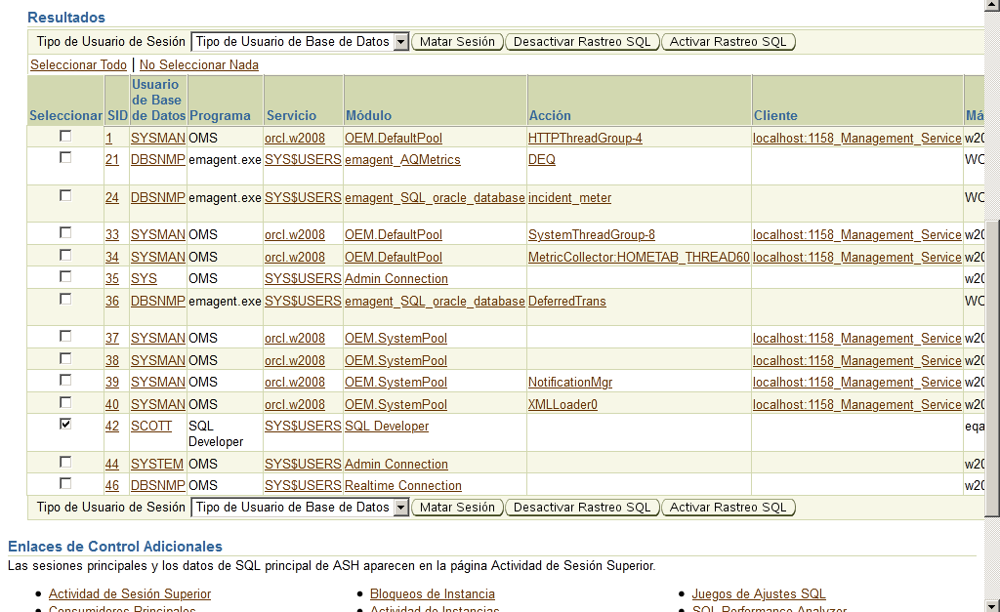

The disconnection can be immediate (rolls back the transactions in progress) or post-transaction (waits to confirm or revoke the transaction in progress and then closes it).

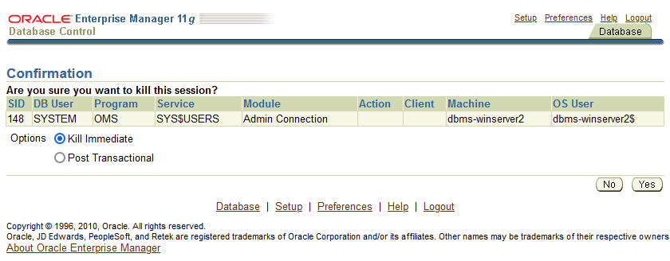 

Notice how after closing this session, nothing can be done from the SYSTEM session.

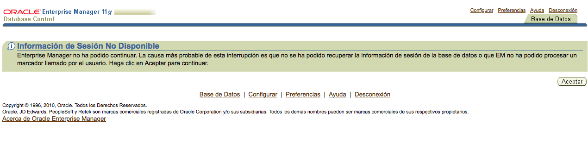

## LINE MODE (SYS user)

Just in case we do not have access to OEM, it could be a good idea to learn how to make all these basic actions from a command line program, such as SQL*PLUS.

First, log in as SYSDBA.

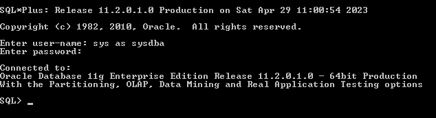

### Shutdown

Give the SHUTDOWN command.

The parameters can be set: NORMAL (default), TRANSACTIONAL, IMMEDIATE or ABORT.

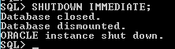

### Start

Give the STARTUP command. If we wanted to start in three steps:

STARTUP NOMOUNT;
ALTER DATABASE MOUNT;
ALTER DATABASE OPEN;

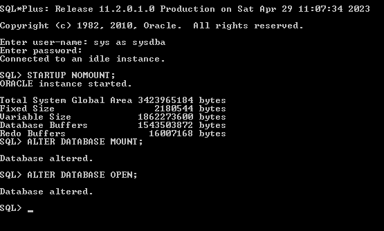

Or in two:

STARTUP MOUNT;
ALTER DATABASE OPEN;

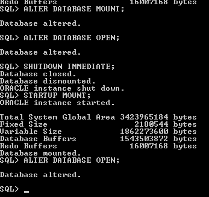

### Initialized parameters

To be able to see the list of initialized parameters, we will issue the SHOW PARAMETERS command.

If we want to modify a parameter without stopping the database, we will have to use the ALTER DATABASE statement, but it does not work with all parameters.

If we want to modify any parameter, the simplest and most foolproof way is the one mentioned before: modify an INIT.ORA file, stop the instance and start it again.

### Sessions
To control the sessions, more specifically, to terminate them, it would be done by means of the ALTER SYSTEM KILL SESSION command, followed by the session number. We can find this out by consulting a view called V$SESSION, accessible only to administrators (for example SYS):

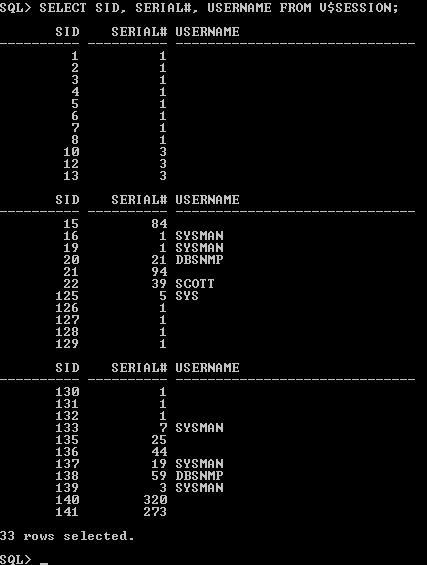

If we assume that these are the sessions in progress, and we want to close the session of the user SCOTT, we would do it with the sentence 

`ALTER SYSTEM KILL SESSION '22,39';`

Before closing the session, a Rollback will automatically be made, leaving any ongoing transactions without effect. 

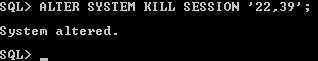

If we don't want to be so drastic, we can do:

`ALTER SYSTEM KILL SESSION '22,39' POST_TRANSACTION;`

The system will then wait for the user to confirm (or reverse) the transaction, and then disconnect the user.