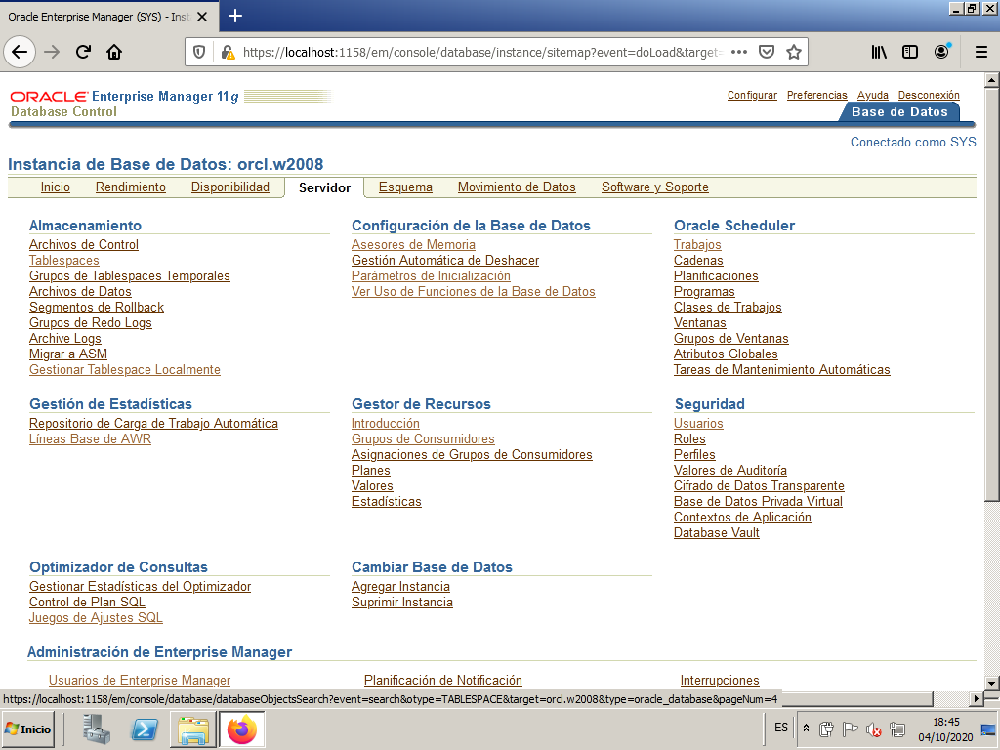
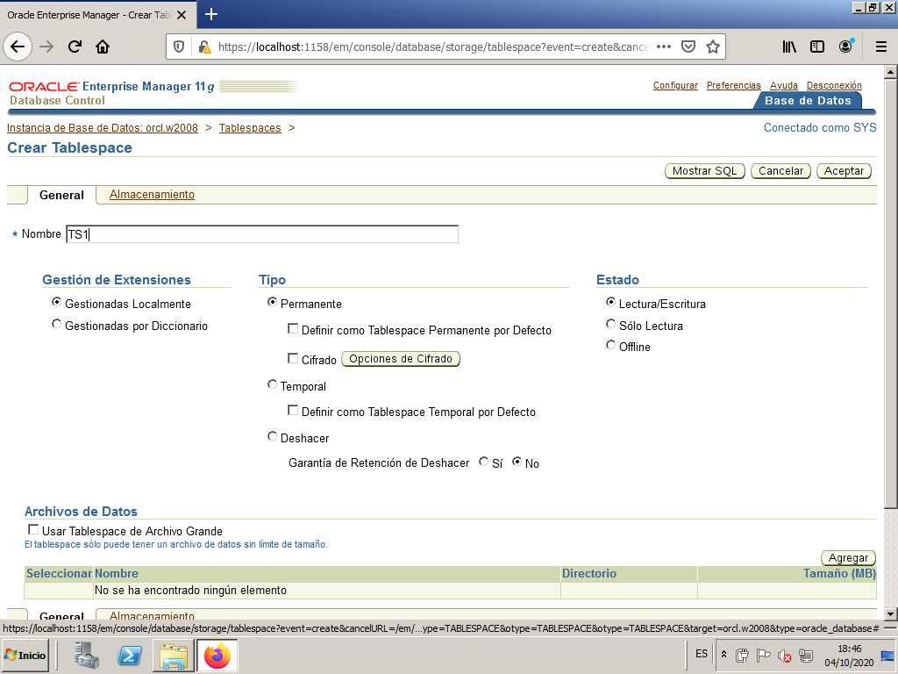
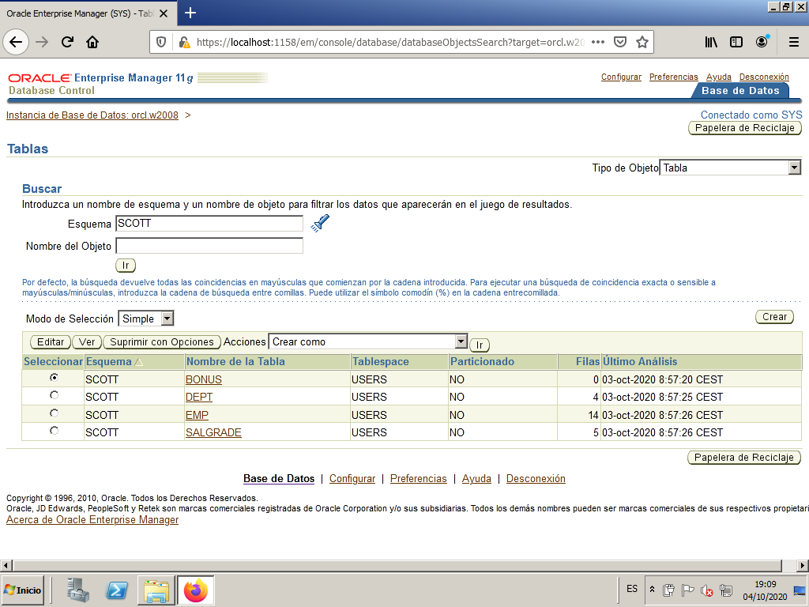
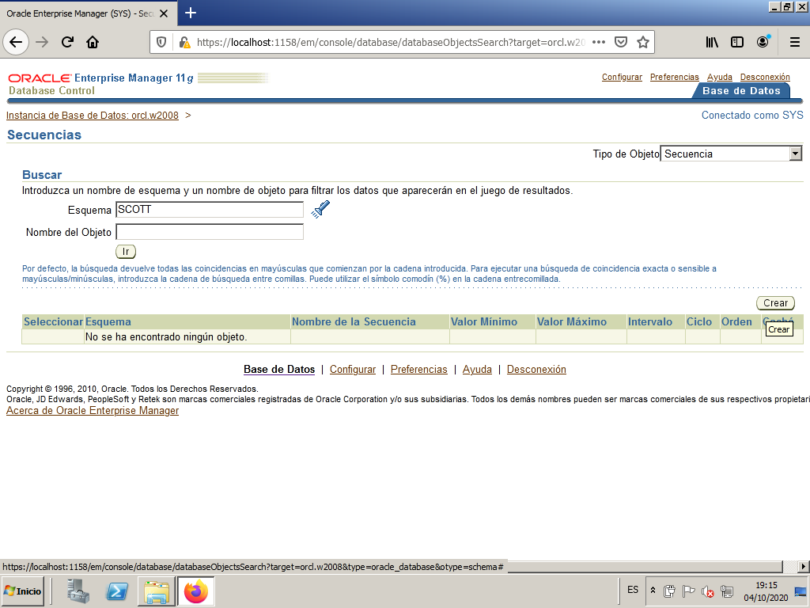

# Oracle other basic administration tasks

In this section we are going to see other basic administration tasks, such as:

- Data dictionary structure
- Space administration
- Object direct management

## Data dictionary structure

The data dictionary, as we defined it before, contains among other things the structure of the tables. It actually contains much more information, about users, connections, statistics, etc. 

They are, in short, a set of tables belonging to SYS user, which contain the structure of all the tables in the database, the views, synonyms, etc. These tables can have a very strange internal structure. Therefore, what is actually used are a series of views, which present the information to us in a more useful way. The complete list of data dictionary views can be consulted in the DICT (dictionary) view, but since there are more than 1200, let's sort them out a bit, and comment on some of them.

Types of views (identifiable by how they start):

| They start with | Meaning |
| :---:| :--- |
| ALL | Returns information about all objects accessible by the user |
| USER | Returns information about all objects owned by the user |
| DBA | Returns a complete list of objects in the Database (Administrators only) | |
| V$ | Dynamic performance views (continuously updated by Oracle). They provide information about performance, file status, and memory used by Oracle. |

So for example, if we entered as user SCOTT, with USER_TABLES we will have all the tables created by him. With ALL_TABLES we will have all the accessible tables (our own and others to which he has permission). With DBA_TABLES we will not access anything because the SCOTT user does not have Administrator permissions. But the SYS user, with DBA_TABLES would see all the tables in the database.

Here are some of the most useful views we can query:

|   | Prefix  |   | Remainder of the name | Meaning                                                  |
|-------------------|:-------------------:|-------------------|----------------------|----------------------------------------------------------|
|                | DBA               |               | _DATA_FILES          | Information about the physical files of the B.D. (those of TableSpaces)            |
| ALL               | DBA               | USER              | _DB_LINKS            | Links with other B.D.                                    |
|                | DBA               | USER              | _FREE_SPACE          | Free space in the TableSpaces (one row for each free fragment)                      |
| ALL               | DBA               | USER              | _TABLES              | Tables                                                   |
| ALL               | DBA               | USER              | _TAB_COLUMNS         | Columns of all tables                                    |
| ALL               | DBA               | USER              | _INDEXES             | Index (including primary keys) of all tables             |
| ALL               | DBA               | USER              | _IND_COLUMNS         | Columns that form the index                              |
| ALL               | DBA               | USER              | _OBJECTS             | Objects (tables, views, synonyms, procedures, triggers, ...)|
| ALL               | DBA               | USER              | _TRIGGERS            | Triggers                                                 |
| ALL               | DBA               | USER              | _CONSTRAINTS         | Constraints for all tables                               |
| ALL               | DBA               | USER              | _VIEWS               | Views, including the SQL statement that forms the view   |
| ALL               | DBA               | USER              | _SYNONYMS            | All synonyms for tables, views, procedures, ...          |
|                | DBA               | USER              | _TABLESPACES         | Description of all tablespaces                           |
| ALL               | DBA               | USER              | _TAB_PRIVS           | Privileges on all objects                               |
|                | DBA               | USER              | _TS_QUOTAS           | User quotas on Tablespaces                              |
| ALL               | DBA               | USER              | _USERS               | Information about users                                 |
| ALL               | DBA               | USER              | _CATALOG             | Tables, views, synonyms. It is a subset of _OBJECTS     |
|                |                   |                   | CAT                  | Synonym for USER_CATALOG                                |
|                   |                   |                   | DICT                 | All data dictionary views                               |
| ALL               | DBA               | USER              | _ERRORS              | Errors occurred during the compilation of a procedure. More comfortable SHOW ERRORS |
|                   |                   |                   | DUAL                 | Dummy table, used in some SQL statements.               |
|                   |                   |                   | V$SESSION            | Information about connected sessions                    |

## Space administration

One of the DBA's tasks will be to reserve enough disk space for the system to work well and for users to be able to save their data without problems. Too much space should not be reserved, as it would be a waste of resources, but we cannot be short.

In Oracle, everything is stored in TableSpaces, which literally means space for tables, each of which consists of one or more physical files. These files are saved, by default, in `C:\app\Administrador\oradata\orcl` if ORCL is the instance name and 'Administrador' the OS user.

The most logical thing, apart from the TableSpaces already created by default, is to divide them by large blocks of users, if we have many, assigning each group of users to a TableSpace.

Thus, according to needs, we can:

- Create new TableSpaces by assigning them new files of certain sizes.
- In the existing TableSpaces we could add new files.
- Expand existing files.

The latter can even be done automatically: when space is needed, the file is expanded.

### OEM - Storage Manager

In Oracle Enterprise Manager we can see the existing TableSpaces and their linked datafiles. We can also modify them or create new ones.

We access OEM as SYSTEM and we look form "Server" tab to access "Tablespaces".

It will serve us to manage the TableSpaces, the DataFiles, the Rollback Segments (place where the updates that are made are saved, in case there is a rollback), the transaction logs or REDO files (which are used to recover the B.D., as we will see later) and the Archive Logs (copies of the previous ones, and which we will also discuss later).

### TableSpaces

We will be able to create, modify and delete TableSpaces, in addition to seeing the use of each one. We can add data files (DataFile) to TableSpaces, modify or delete them. We can make it active (online) or not (offline).

First we click on "TableSpaces".

We can see all existing TableSpaces, along with the reserved disk size (Allocated Size), the used space in MB and %, if it will autoexpand or not, etc.

### Datafiles

They are always associated with a TableSpace. They are the files we can find in the OS. In this image we can see the files for the previous TableSpaces. See that they are the files with .DBF extension

We can also select a TableSpace and clic on `View` button to see all its information. Among other things we can see the DataFiles associated to that TableSpace.

Managing rollback segments (RollBack Segments) may be beyond the scope of this course. We will simply know that there are a few segments of these and that the system uses them to be able to guarantee rollbacks.

The management of Redo Logs and Archive Logs is also a bit beyond the level of this course, and in addition some explanations are still missing to understand these files.

### Command line mode

The statements to modify TableSpaces are CREATE, ALTER and DROP TABLESPACE. For example if we want to create a TableSpace called TS1, with a data file called 'TS101.ORA' of 2 Mb that autoincrements by 1 Mb. when a maximum of 10 Mb is needed:

`CREATE TABLESPACE ts1
DATAFILE 'ts101.ora' SIZE 2M AUTOEXTEND ON NEXT 1M MAXSIZE 10M;`

To add a file to an already existing TableSpace we would use the statement:

`ALTER TABLESPACE ... ADD DATAFILE;`

with the same structure as the previous one.

### Guided practice - How to create a tablespace

In this guided practice we are going to create a new tablespace, with a datafile that must keep getting bigger as it fills up to a maximum size.

From the Enterprise Manager we go to `Server -> Storage -> Tablespaces`.

By default, the existing tablespaces appear. Press the `Create' button to start the process of creating a new tablespace.

We write the number of the new tablespace `TS1`. We leave the rest of the options by default. We press the ``Add'' button to create a new file associated with the tablespace.

We select the following options:
* File number: `TS1`.
* File size: `1MB`.
* We mark the check box `Automatically expand ...'`
* Increase: `512KB`.
* Maximum file size: `5MB`.

Press the ``Continue'' button.

We press the ``Accept'' button so that the modifications on the file become effective.

We get our new tablespace in the list of tablespaces.

## Object direct management

There will be occasions when the DBA will have to directly manipulate objects, not only their own, but any user. You will need to create tables, copy them, create views, create accesses, give permissions, etc. This will require the direct management of objects (tables, views, synonyms, ...).

There will be occasions when the DBA will have to directly manipulate objects, not only their own, but any user's. You will need to create tables, copy them, create views, create accesses, give permissions, etc. This will require the direct management of objects (tables, views, synonyms, ...).

Let's see how to manage tables for user Scott using OEM.

From the Enterprise Manager we go to ``Scheme -> Database Objects -> Tables''.

To see the tables of the 'scott' scheme, enter the number and give it to the `Go` button. In this way we obtain the list with the tables.

We select the `DEPT` table and press the `View` button.

Now we can choose the `View Data` option in the `Actions` dropdown menu. We must press the `Go` button.

We see the rows of the selected table, as well as the SQL associated with the action we just performed.

### Create a sequence

From the Enterprise Manager, go to `Scheme -> Database Objects -> Sequences`.

We select the scheme `scott` and press `Go`.

Then we press on `Create`button to create a new Sequence. We give the new sequence the name `S1`.

We set the maximum value as unlimited.

We choose `Show SQL` to see the code that is going to be executed.

We press `Back`.

We press `Accept`.

